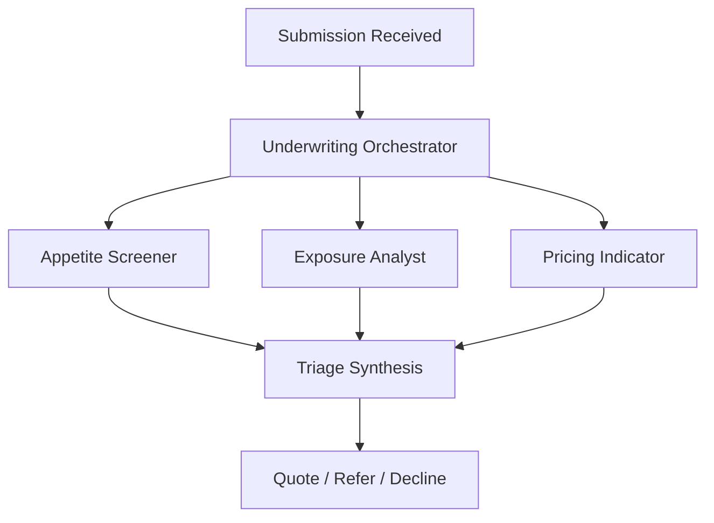

# Underwriting Submission Triage Use Case

## Overview

The Underwriting Submission Triage application assists commercial property and casualty underwriters by screening a broker's submission against written risk appetite, quantifying aggregate exposure and loss history, and producing a technical price indication — synthesised into a quote, refer or decline decision.

## Architecture



The three specialists run concurrently. Synthesis applies precedence rather than averaging: a breach of a prohibition, limit or requirement rule is dispositive, referral findings are weighable, and pricing may never upgrade an outcome.

## Agents

### Appetite Screener

Screens the submission against the insurer's risk appetite ruleset, which is carried as data in the submission's compliance record rather than hardcoded. Reports rules satisfied and breached by rule id, and identifies prohibited occupancy classes at both applicant and location level. Also reads the loss runs, since some appetite rules are claims-based — a referral threshold on the size of any single open claim cannot be evaluated from the profile and ruleset alone.

### Exposure Analyst

Aggregates total insured value across the property schedule, computes concentration by catastrophe zone for locations flagged as exposed to the relevant peril, and assesses prior claims for frequency, severity, trend and open reserves.

### Pricing Indicator

Anchors on the expiring programme's rate and adjusts for loss experience, catastrophe exposure, physical risk features and data quality. Returns a zero indication with a stated reason where a risk should not be priced. Also identifies information required from the broker before a firm quotation.

## Framework Support

Strands only. There is no `langchain_langgraph` mirror; the framework router rejects that value explicitly rather than failing on import.

## Deployment

```bash
USE_CASE_ID=underwriting_submission FRAMEWORK=strands ./scripts/deploy/full/deploy_agentcore.sh
```

## Testing

```bash
./scripts/use_cases/underwriting_submission/test/test_agentcore.sh
```

## Sample Data

Located at `data/samples/underwriting_submission/`. The appetite ruleset is identical across all three submissions — the same rules produce three different outcomes.

| Submission ID | Applicant                                                             | TIV    | Expected |
| ------------- | --------------------------------------------------------------------- | ------ | -------- |
| SUB001        | Ohio machine shop, 3 inland masonry locations, clean loss runs        | $14.0M | quote    |
| SUB002        | MO/KS/AR food processor, open $400K claim, incomplete schedule        | $36.3M | refer    |
| SUB003        | FL/TX marine terminal and metal salvage, coastal and prohibited class | $29.0M | decline  |

## Triage Modes

| Mode            | Runs                                                                    | Returns a decision |
| --------------- | ----------------------------------------------------------------------- | ------------------ |
| `full`          | All three specialists                                                   | Yes                |
| `appetite_only` | Appetite Screener                                                       | No                 |
| `exposure_only` | Exposure Analyst — portfolio and catastrophe-modelling use              | No                 |
| `pricing_only`  | Pricing Indicator — actuarial benchmarking on declined or lost business | No                 |

Only a full triage yields a `decision`. Appetite screening alone is sufficient to decline but never sufficient to quote, and exposure or pricing alone cannot decide in either direction. On partial modes the summary states explicitly which assessment was not performed.

## API Reference

### Request

```json
{
  "submission_id": "SUB003",
  "triage_type": "full"
}
```

### Response

```json
{
  "submission_id": "SUB003",
  "assessment_id": "uuid",
  "decision": "decline",
  "appetite_review": {
    "status": "out_of_appetite",
    "checks_failed": ["APP-01", "APP-03", "APP-08"],
    "prohibited_classes_triggered": ["scrap_metal_yard"]
  },
  "exposure_assessment": {
    "total_insured_value": 29000000.0,
    "severity": "critical",
    "concentration_flags": ["FL_GULF_COAST 67.9% of TIV"]
  },
  "pricing_indication": {
    "indicated_premium": 0.0,
    "loss_ratio_estimate": 1.22,
    "confidence_score": 0.9
  },
  "missing_information": ["Hot work permit procedure for LOC-2"],
  "summary": "..."
}
```

## Roadmap

- **Document inputs** — loss runs and property schedules as PDFs via `extract_pdf_text`, retaining JSON twins for comparison. `profile.json` and `compliance.json` remain JSON as insurer system data.
- **Appetite gate** — short-circuit the exposure and pricing agents when appetite screening fails. Prerequisite is structured per-agent output in `StrandsOrchestrator`, since agent results are currently free text and control flow cannot safely branch on them.

## Related Documentation

- [Use Case README](../../../use_cases/underwriting_submission/README.md)
- [FSI Foundry Overview](../../../README.md)
- [Architecture Patterns](../../foundations/architecture/architecture_patterns.md)
- [Deployment Guide](../../foundations/deployment/deployment_patterns.md)
