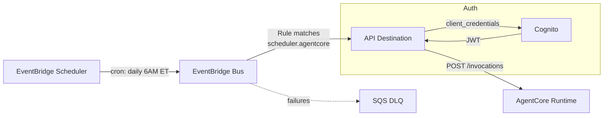

# Compliance Deadline Monitor — Scheduled Agent → AgentCore

Runs daily on a schedule to check regulatory filing deadlines, identify at-risk items,
and generate escalation recommendations. Uses the EventBridge Scheduler → AgentCore pattern.

## Architecture



> **Why Scheduler → Bus → API Destination?** EventBridge Scheduler can't target API
> Destinations directly. Scheduler puts an event on the custom bus, then a Rule routes
> it to the API Destination that calls AgentCore.

## How It Works

1. EventBridge Scheduler fires daily at 6 AM ET (configurable)
2. Scheduler puts an event on the custom bus with source `scheduler.agentcore`
3. Rule matches and routes to the API Destination via InputTransformer
4. API Destination authenticates via Cognito OAuth and calls AgentCore
5. Agent checks the filing calendar, classifies urgency, and generates a briefing:
   - **OVERDUE** — past due, immediate escalation to CCO
   - **CRITICAL** (≤3 days) — escalate to BSA Officer
   - **WARNING** (≤7 days) — escalate to team lead
   - **ON_TRACK** (>7 days) — no action needed

## Agents

| Agent | Role |
|-------|------|
| Deadline Tracker | Retrieves calendar, calculates days remaining, classifies urgency |
| Risk Assessor | Evaluates miss probability, determines escalation path, recommends mitigations |

## Supported Filing Types

- **SAR** — Suspicious Activity Reports (30/60 day window)
- **CTR** — Currency Transaction Reports (15 days)
- **SEC 10-K** — Annual filings (60 days after FYE)
- **SEC 10-Q** — Quarterly filings (40 days after quarter end)
- **Call Reports** — Bank regulatory filings (30 days)
- **FR Y-9C** — Bank holding company reports (40 days)

## Companion Use Case

This pairs with the **Regulatory Report Reviewer** (S3 File Processing pattern):
- **This agent** watches the *calendar* and alerts before deadlines slip
- **Report Reviewer** reviews the *content* of filings for quality before submission

Together they form a complete compliance automation workflow.

## Prerequisites

- AWS CLI v2, SAM CLI, Docker (with buildx)
- A Bedrock AgentCore–enabled AWS account
- Bedrock model access (Amazon Nova Pro)

## Deploy

```bash
./deploy.sh

# Custom schedule (every 6 hours) and region
SCHEDULE_EXPR="rate(6 hours)" AWS_REGION=us-west-2 ./deploy.sh
```

### Environment Variables

| Variable | Default | Description |
|---|---|---|
| `STACK_NAME` | `compliance-deadline-monitor` | CloudFormation stack name |
| `AGENT_NAME` | `compliance_deadline_monitor_agent` | AgentCore runtime name |
| `AWS_REGION` | `us-east-1` | AWS region |
| `SCHEDULE_EXPR` | `cron(0 11 * * ? *)` | Schedule (default: 6 AM ET daily) |

## Test

Trigger manually without waiting for the schedule:

```bash
STACK_NAME=compliance-deadline-monitor
EVENT_BUS="${STACK_NAME}-bus"

aws events put-events --entries "[{
  \"EventBusName\": \"${EVENT_BUS}\",
  \"Source\": \"scheduler.agentcore\",
  \"DetailType\": \"ScheduledAgentInvocation\",
  \"Detail\": \"{\\\"prompt\\\": \\\"Run the daily compliance deadline check. Identify all at-risk filings and provide escalation recommendations.\\\"}\"
}]"
```

Then check AgentCore runtime logs for the compliance briefing output.

## Project Structure

```
compliance_deadline_monitor/
├── agent/
│   ├── agent.py              # AgentCore entrypoint (tools: get_filing_calendar, get_current_date)
│   ├── Dockerfile
│   └── requirements.txt
├── src/
│   └── strands/
│       ├── __init__.py       # Agent registration
│       ├── orchestrator.py   # Parallel DeadlineTracker + RiskAssessor
│       ├── models.py         # Pydantic request/response models
│       ├── config.py         # Settings
│       └── agents/
│           ├── __init__.py
│           ├── deadline_tracker.py
│           └── risk_assessor.py
├── test event/
│   └── testEvent.json        # Sample event payload
├── template.yaml             # SAM template (Cognito, EventBridge bus, DLQ)
├── deploy.sh                 # One-command deployment (includes Scheduler creation)
└── README.md
```

## Cleanup

```bash
STACK_NAME=compliance-deadline-monitor
REGION=us-east-1

aws scheduler delete-schedule --name "${STACK_NAME}-schedule" --region "${REGION}"
aws events remove-targets --rule "${STACK_NAME}-rule" --event-bus-name "${STACK_NAME}-bus" --ids AgentCoreTarget --region "${REGION}"
aws events delete-rule --name "${STACK_NAME}-rule" --event-bus-name "${STACK_NAME}-bus" --region "${REGION}"
aws events delete-api-destination --name "${STACK_NAME}-dest" --region "${REGION}"
aws events delete-connection --name "${STACK_NAME}-connection" --region "${REGION}"
sam delete --stack-name "${STACK_NAME}" --region "${REGION}"
```
