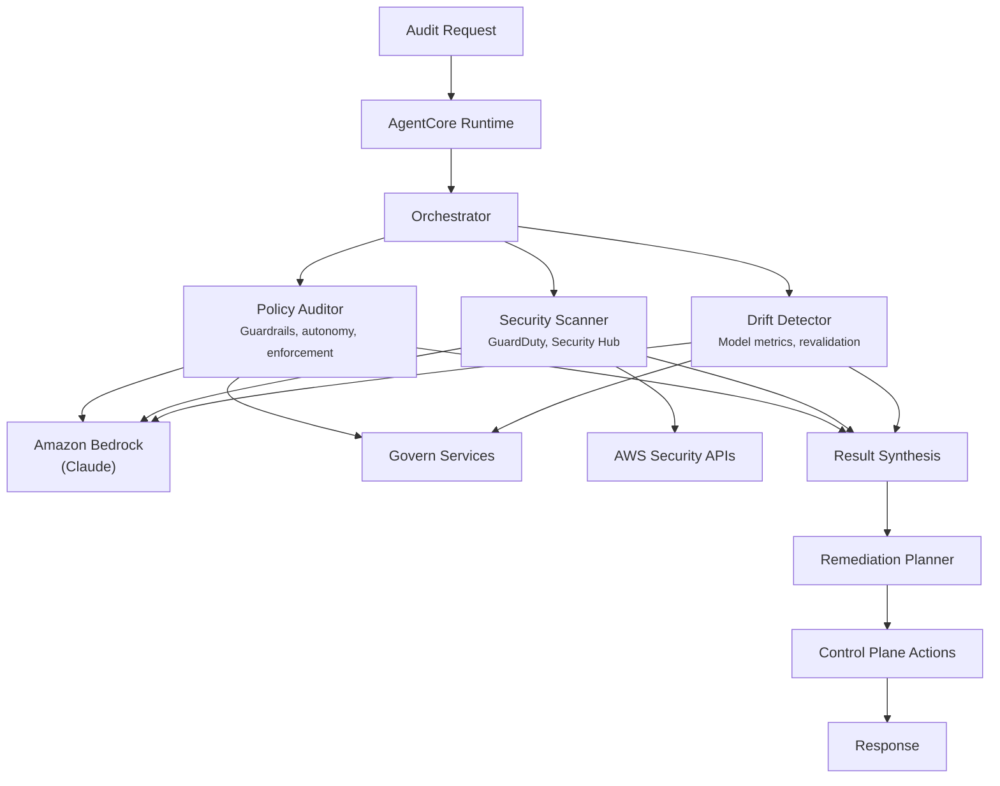

# Govern Compliance Agent

## Overview

The Govern Compliance Agent is a self-governing compliance system for the AVA platform that audits AgentCore deployments, AWS security posture, and model governance. It detects policy violations, security issues, and drift, then takes corrective action within defined autonomy bounds. This agent runs **inside AgentCore** and can remediate issues it discovers through the control plane.

## Business Value

- **Continuous compliance** -- automated auditing eliminates gaps between periodic manual reviews
- **Proactive security** -- correlates GuardDuty and Security Hub findings for AI-specific threats
- **Governance at scale** -- monitors hundreds of agents and models without manual intervention
- **Safe automation** -- approval gates prevent unauthorized changes; autonomy ladder governs scope
- **Audit trail** -- every decision and action is logged for regulatory examination

## Architecture



### Directory Structure

```
use_cases/govern_compliance_agent/
├── README.md
├── invoke_agentcore.py       # CLI for AgentCore SDK invocation
├── test_local.py             # Local test script
└── src/
    ├── __init__.py           # Registry entry point with framework switch
    ├── langchain_langgraph/
    │   ├── __init__.py
    │   ├── config.py         # GovernComplianceSettings
    │   ├── models.py         # Pydantic request/response models
    │   ├── orchestrator.py   # GovernComplianceOrchestrator + run_compliance_audit()
    │   ├── agents/
    │   │   ├── __init__.py
    │   │   ├── policy_auditor.py
    │   │   ├── security_scanner.py
    │   │   ├── drift_detector.py
    │   │   └── remediation_planner.py
    │   └── tools/
    │       ├── __init__.py
    │       ├── agentcore_tools.py
    │       ├── control_plane_tools.py
    │       ├── enforcement_tools.py
    │       ├── guardrail_tools.py
    │       └── security_tools.py
    └── strands/
        ├── __init__.py
        ├── config.py
        ├── models.py
        ├── orchestrator.py
        ├── agents/
        │   ├── __init__.py
        │   ├── policy_auditor.py
        │   ├── security_scanner.py
        │   ├── drift_detector.py
        │   └── remediation_planner.py
        └── tools/
            ├── __init__.py
            └── govern_tools.py
```

## Agentic Design

The orchestrator uses a **parallel fan-out → remediation** pattern. In `all` mode:
1. Policy Auditor, Security Scanner, and Drift Detector run concurrently
2. Results are synthesized into a prioritized violation list
3. Remediation Planner creates action plans with approval gates
4. Auto-approved actions execute immediately; others queue for human review

For targeted scans, individual agents run in isolation (`agents`, `security`, `drift`, or `privacy` modes).

## Agents

| Agent | Role | Data Sources | Output |
|-------|------|--------------|--------|
| **Policy Auditor** | Checks agent configurations against governance policies | GovernAgentCoreService, GovernGuardrailsService, GovernEnforcementService | Missing guardrails, autonomy mismatches, policy violations |
| **Security Scanner** | Scans AWS security posture for AI workloads | GovernGuardDutyAIService, GovernSecurityHubAIService | Critical/high findings, AI-specific threats, compliance gaps |
| **Drift Detector** | Monitors for model and configuration drift | GovernModelInventoryService | Revalidation status, performance metrics, provenance issues |
| **Remediation Planner** | Creates action plans and executes approved fixes | Orchestrator output | Planned actions, executed results, pending approvals |

## Control Plane Actions

| Action | Risk | Approval |
|--------|------|----------|
| Assign existing guardrail (L2 agent) | Medium | **Auto** |
| Update autonomy tier (downward) | Medium | **Auto** |
| Trigger model revalidation | Low | **Auto** |
| Create enforcement policy | High | **Human Required** |
| Increase autonomy tier | High | **Human Required** |
| Pause agent runtime | Critical | **Human Required** |

## Data and Tools

- **Backend Services:** GovernAgentCoreService, GovernGuardrailsService, GovernEnforcementService, GovernGuardDutyAIService, GovernSecurityHubAIService, GovernModelInventoryService
- **Model:** Claude Haiku for sub-agents, Claude Sonnet for remediation planning
- **Config thresholds:** `revalidation_warning_days=30`, `revalidation_critical_days=90`, `error_rate_warning=1%`, `error_rate_critical=5%`

## Request / Response

**Request** -- `ComplianceAuditRequest`:

| Field | Type | Description |
|-------|------|-------------|
| `scope` | `AuditScope` | `all`, `agents`, `security`, `drift`, `privacy` |
| `include_remediation` | `bool` | Whether to generate remediation plans (default: True) |
| `auto_remediate` | `bool` | Execute auto-approved actions (default: False) |
| `dry_run` | `bool` | Preview changes without executing (default: True) |
| `target_agents` | `list[str] \| None` | Specific agent IDs to audit |

**Response** -- `ComplianceAuditResponse`:

| Field | Type | Description |
|-------|------|-------------|
| `audit_id` | `str` | Unique audit UUID |
| `timestamp` | `datetime` | Audit timestamp |
| `scope` | `AuditScope` | Audit scope |
| `violations` | `list[Violation]` | Detected violations with severity |
| `remediations` | `list[RemediationAction]` | Planned/executed remediation actions |
| `summary` | `str` | Executive summary |
| `agents_scanned` | `int` | Number of agents audited |
| `models_scanned` | `int` | Number of models audited |
| `findings_by_severity` | `dict[str, int]` | Count by severity level |
| `raw_analysis` | `dict` | Raw output from each agent |

## Quick Start

```bash
# Test locally (requires backend running)
cd applications/fsi_foundry/use_cases/govern_compliance_agent
python test_local.py

# List AgentCore runtimes
python invoke_agentcore.py --list-runtimes

# Deploy to AgentCore
USE_CASE_ID=govern_compliance_agent ./scripts/deploy/full/deploy_agentcore.sh

# Run via AgentCore SDK
python invoke_agentcore.py --runtime-arn <arn> --scope all
```

## Configuration

Environment variables:
- `AWS_REGION` - AWS region (default: us-east-1)
- `GOVERN_TABLE_NAME` - DynamoDB table for Govern data (default: ava-govern-dev)
- `AGENT_FRAMEWORK` - `langchain_langgraph` (default) or `strands`

## Related Documentation

- [FSI Foundry Overview](../../../README.md)
- [Govern Module](../../../../platform/control_plane/frontend/src/pages/govern/README.md)
- [Architecture Patterns](../../docs/foundations/architecture/architecture_patterns.md)
- [Deployment Guide](../../docs/foundations/deployment/deployment_patterns.md)
