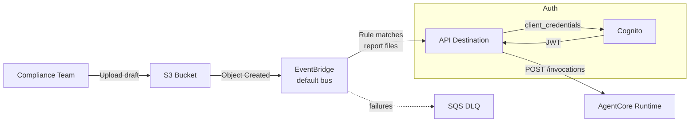

# Regulatory Report Reviewer — S3 File Processing → AgentCore

Automatically reviews regulatory filings uploaded to S3 using a multi-agent system
on Bedrock AgentCore. When a compliance team member uploads a draft report (SAR, CTR,
10-K, etc.), EventBridge triggers the agent which reviews it for completeness,
language compliance, and overall quality.

## Architecture



## How It Works

1. Compliance officer uploads a draft regulatory filing to the S3 bucket
2. S3 sends an `Object Created` event to the EventBridge default bus
3. Rule matches `.txt`, `.md`, `.pdf`, `.docx`, `.json` files from the bucket
4. InputTransformer extracts bucket/key into a prompt for the agent
5. API Destination authenticates via Cognito OAuth and calls AgentCore
6. Agent reads the file and performs a three-part review:
   - **Completeness** — required sections and fields present
   - **Language Compliance** — regulatory terminology, no vague/informal language
   - **Quality** — clarity, consistency, submission readiness

## Agents

| Agent | Role |
|-------|------|
| Completeness Checker | Verifies required sections/fields per report type |
| Language Reviewer | Checks regulatory terminology and flags informal language |
| Quality Assessor | Evaluates clarity, consistency, and submission readiness |

## Supported Report Types

- **SAR** — Suspicious Activity Reports (FinCEN)
- **CTR** — Currency Transaction Reports
- **SEC 10-K / 10-Q** — Annual and quarterly SEC filings
- **Call Reports** — Bank regulatory filings
- Other regulatory documents

## Prerequisites

- AWS CLI v2, SAM CLI, Docker (with buildx)
- A Bedrock AgentCore–enabled AWS account
- Bedrock model access (Amazon Nova Pro)

## Deploy

```bash
./deploy.sh

# Custom stack name and region
STACK_NAME=my-reviewer AWS_REGION=us-west-2 ./deploy.sh
```

## Test

```bash
STACK_NAME=reg-report-reviewer
ACCOUNT_ID=$(aws sts get-caller-identity --query Account --output text)
BUCKET="${STACK_NAME}-uploads-${ACCOUNT_ID}"

aws s3 cp "test event/sample_sar.txt" "s3://${BUCKET}/reports/sample_sar.txt"
```

Then check the AgentCore runtime logs for the review output.

## Project Structure

```
regulatory_report_reviewer/
├── agent/
│   ├── agent.py              # AgentCore entrypoint (Strands + read_s3_file tool)
│   ├── Dockerfile
│   └── requirements.txt
├── src/
│   └── strands/
│       ├── __init__.py       # Agent registration
│       ├── orchestrator.py   # Multi-agent orchestration
│       ├── models.py         # Pydantic request/response models
│       ├── config.py         # Settings
│       └── agents/
│           ├── __init__.py
│           ├── completeness_checker.py
│           ├── language_reviewer.py
│           └── quality_assessor.py
├── test event/
│   └── sample_sar.txt        # Sample SAR for testing
├── template.yaml             # SAM template (S3, Cognito, DLQ)
├── deploy.sh                 # One-command deployment
└── README.md
```

## Cleanup

```bash
STACK_NAME=reg-report-reviewer
REGION=us-east-1
ACCOUNT_ID=$(aws sts get-caller-identity --query Account --output text)

aws s3 rm "s3://${STACK_NAME}-uploads-${ACCOUNT_ID}" --recursive
aws events remove-targets --rule "${STACK_NAME}-rule" --ids AgentCoreTarget --region "${REGION}"
aws events delete-rule --name "${STACK_NAME}-rule" --region "${REGION}"
aws events delete-api-destination --name "${STACK_NAME}-dest" --region "${REGION}"
aws events delete-connection --name "${STACK_NAME}-connection" --region "${REGION}"
sam delete --stack-name "${STACK_NAME}" --region "${REGION}"
```
