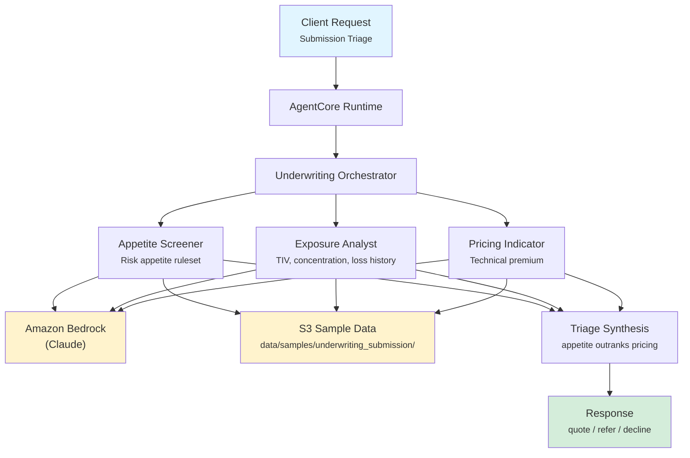

# Underwriting Submission Triage

Commercial insurance submission triage for property and casualty underwriting. Screens a broker's submission against written risk appetite, quantifies aggregate exposure and loss history, and produces a technical price indication, synthesised into a quote / refer / decline decision.

## Overview

A business seeking commercial insurance does not approach an insurer directly. A broker assembles a package describing the risk — the applicant, the coverage requested, a schedule of every insured location, and a history of claims made against previous insurers — and sends it to several insurers at once. That package is a **submission**.

Underwriters receive far more submissions than they can analyse and win only a fraction of what they quote, so the critical skill is triage: deciding quickly which submissions deserve the work and declining the rest early rather than after two days of analysis.

This use case automates that first pass. It answers three questions in parallel and reconciles them:

1. **Is it something we are permitted to write?** Screening against the insurer's risk appetite ruleset.
2. **How much could we lose?** Aggregate insured value, geographic concentration, and prior claims.
3. **What should it cost?** A technical premium indication, before commercial negotiation.

## Business Value

- **Faster triage** — declines are identified in minutes rather than after a full manual review, freeing underwriter time for submissions that can actually be won
- **Consistent appetite application** — the same ruleset is applied to every submission, with each finding citing the rule it came from
- **Auditable decisions** — every conclusion traces back to a specific rule and the data that breached it, which is what a peer reviewer or regulator needs
- **Earlier data-quality feedback** — missing schedule fields and incomplete loss runs are surfaced as a list the broker can action, rather than discovered late in the quoting process
- **Portfolio protection** — concentration in catastrophe-exposed zones is quantified rather than eyeballed

## Architecture



### Directory Structure

```
use_cases/underwriting_submission/
├── README.md
└── src/
    ├── __init__.py                        # Framework router
    └── strands/
        ├── __init__.py                    # Registry registration
        ├── config.py                      # Data prefix and model selection
        ├── models.py                      # SubmissionRequest / SubmissionResponse
        ├── orchestrator.py                # UnderwritingOrchestrator
        └── agents/
            ├── appetite_screener.py       # AppetiteScreener
            ├── exposure_analyst.py        # ExposureAnalyst
            └── pricing_indicator.py       # PricingIndicator
```

This use case ships a **Strands implementation only**. There is no `langchain_langgraph` mirror; the framework router rejects that value explicitly rather than failing with a confusing import error.

## Agentic Design

The `UnderwritingOrchestrator` extends `StrandsOrchestrator` and implements a **parallel fan-out / synthesise** pattern:

1. **Router** — inspects `triage_type` to decide which specialists to invoke.
2. **Parallel execution** — for a full triage, all three specialists run concurrently via `asyncio.gather()`. Each retrieves the records its specialism needs and works independently.
3. **Weighted synthesis** — a supervisor LLM call reconciles the three assessments. The specialists are not equal authorities; see Design Notes.
4. **Response mapping** — the synthesised JSON is parsed into Pydantic models. A parse failure degrades to raw text in `summary` rather than failing the invocation.

## Agents

### Appetite Screener

| Field        | Detail                                                                                                                                                                                                                                                                                         |
| ------------ | ---------------------------------------------------------------------------------------------------------------------------------------------------------------------------------------------------------------------------------------------------------------------------------------------- |
| **Class**    | `AppetiteScreener(StrandsAgent)`                                                                                                                                                                                                                                                               |
| **Role**     | Screens the submission against the insurer's written risk appetite ruleset                                                                                                                                                                                                                     |
| **Data**     | Submission profile, appetite ruleset and regulatory record, and loss runs via `s3_retriever_tool`. The loss runs are needed because some appetite rules are claims-based — a referral threshold on the size of any single open claim cannot be evaluated without the individual claim records. |
| **Produces** | Appetite status (IN_APPETITE / OUT_OF_APPETITE / REFERRAL_REQUIRED), rules passed and breached with rule ids, prohibited classes found                                                                                                                                                         |
| **Model**    | Amazon Bedrock (Claude), temperature 0.1                                                                                                                                                                                                                                                       |

### Exposure Analyst

| Field        | Detail                                                                                                                     |
| ------------ | -------------------------------------------------------------------------------------------------------------------------- |
| **Class**    | `ExposureAnalyst(StrandsAgent)`                                                                                            |
| **Role**     | Quantifies aggregate exposure and assesses prior claims                                                                    |
| **Data**     | Submission profile with property schedule, loss runs via `s3_retriever_tool`                                               |
| **Produces** | Total insured value, severity (LOW / MODERATE / HIGH / CRITICAL), catastrophe concentration flags, loss history assessment |
| **Model**    | Amazon Bedrock (Claude), temperature 0.1                                                                                   |

### Pricing Indicator

| Field        | Detail                                                                                                      |
| ------------ | ----------------------------------------------------------------------------------------------------------- |
| **Class**    | `PricingIndicator(StrandsAgent)`                                                                            |
| **Role**     | Produces a technical price indication and identifies missing information                                    |
| **Data**     | Submission profile, loss runs and expiring programme via `s3_retriever_tool`                                |
| **Produces** | Indicated premium, rate per thousand, expected loss ratio, confidence score, items required from the broker |
| **Model**    | Amazon Bedrock (Claude), temperature 0.1                                                                    |

## Data and Tools

- **Tool:** `s3_retriever_tool` — retrieves submission records from S3 by submission id and data type
- **S3 path:** `data/samples/underwriting_submission/{submission_id}/`

| File                  | `data_type`      | Contents                                                                                                                                                                |
| --------------------- | ---------------- | ----------------------------------------------------------------------------------------------------------------------------------------------------------------------- |
| `profile.json`        | `profile`        | Applicant, coverage requested, property schedule (one entry per location with values, construction, protection, age and catastrophe exposure), stated outstanding items |
| `credit_history.json` | `credit_history` | Loss runs — individual claims, reconciled totals, prior carriers, expiring programme and premium, applicant financials                                                  |
| `compliance.json`     | `compliance`     | Risk appetite ruleset, licensing and admitted status, sanctions screening, regulatory findings                                                                          |

`credit_history` carries the loss runs. The name is inherited from the shared retriever's fixed set of data types and fills the same role it does elsewhere: the entity's historical track record.

## Triage Modes

`triage_type` selects which specialists run. Their intended users differ, and only the first two are everyday underwriting paths.

| Mode            | Runs              | Intended use                                                                                                                                                                                                                                                                      |
| --------------- | ----------------- | --------------------------------------------------------------------------------------------------------------------------------------------------------------------------------------------------------------------------------------------------------------------------------- |
| `full`          | All three         | The standard triage path. The only mode that produces a `decision`.                                                                                                                                                                                                               |
| `appetite_only` | Appetite Screener | Cheap first pass. Useful when you only need to know whether the risk is permitted at all.                                                                                                                                                                                         |
| `exposure_only` | Exposure Analyst  | **Portfolio and catastrophe-modelling use**, not routine underwriting — "what would this add to our Gulf Coast aggregate?" is asked independently of whether the account would be written. Also useful on renewals where appetite was settled previously and only values changed. |
| `pricing_only`  | Pricing Indicator | **Actuarial benchmarking**, not routine underwriting — "what would we have charged?" for accounts that were declined or lost. Deliberately run on business that failed appetite.                                                                                                  |

**Only `full` returns a `decision`.** On the three partial modes `decision` is `null`, and the summary states explicitly which assessment was not carried out. This is deliberate: appetite screening alone is sufficient to decline but never sufficient to quote, and exposure or pricing alone cannot decide in either direction — a critical exposure may still be quotable at the right price, and an attractive price on a prohibited risk is still a decline. Rather than assert an outcome drawn from a third of the evidence, the field is left unset and the caller reads the specialist section directly.

## Request / Response

### Request (`SubmissionRequest`)

```python
class SubmissionRequest(BaseModel):
    submission_id: str                       # e.g. "SUB001"
    triage_type: TriageType = "full"          # full | appetite_only | exposure_only | pricing_only
    additional_context: str | None = None     # e.g. broker commentary
```

### Response (`SubmissionResponse`)

```python
class SubmissionResponse(BaseModel):
    submission_id: str
    assessment_id: str                        # UUID
    timestamp: datetime
    decision: str | None                      # quote | refer | decline — full triage only
    appetite_review: AppetiteReview | None            # status, checks passed/failed, prohibited classes
    exposure_assessment: ExposureAssessment | None    # TIV, severity, concentration, loss history
    pricing_indication: PricingIndication | None      # premium, rate, loss ratio, confidence
    missing_information: list[str]            # items required from the broker
    summary: str                              # executive summary and rationale
    raw_analysis: dict                        # unstructured output from each specialist
```

## Quick Start

```bash
# Deploy to AgentCore
USE_CASE_ID=underwriting_submission FRAMEWORK=strands \
  ./scripts/deploy/full/deploy_agentcore.sh

# Test
./scripts/use_cases/underwriting_submission/test/test_agentcore.sh
```

## Sample Data

Three submissions, graded so that each decision path is exercised. The appetite ruleset is identical across all three — the same rules produce three different outcomes.

| Submission | Applicant                                                                              | TIV    | Signal                                                                                                                          | Expected    |
| ---------- | -------------------------------------------------------------------------------------- | ------ | ------------------------------------------------------------------------------------------------------------------------------- | ----------- |
| `SUB001`   | Meridian Precision Components LLC — Ohio machine shop, 3 inland masonry locations      | $14.0M | 5 years of loss runs, two small closed claims, loss ratio 0.06                                                                  | **quote**   |
| `SUB002`   | Harvest Ridge Foods Inc. — MO/KS/AR frozen food processor, 5 locations                 | $36.3M | Open $400K fire claim breaches the referral threshold; roof ages missing for 3 locations; only 3 of 5 years of loss runs        | **refer**   |
| `SUB003`   | Gulfline Terminal & Salvage LLC — FL/TX marine terminal and metal salvage, 4 locations | $29.0M | Prohibited occupancy class; two locations inside the coastal prohibition; 67.9% of value in one hurricane zone; loss ratio 1.22 | **decline** |

`SUB001` passing cleanly is deliberate — it demonstrates that the screening discriminates rather than flagging everything. `SUB003` also passes six of the ten appetite rules; its inland location is frame construction but only two storeys, so the frame rule correctly does not fire.

## Design Notes

**The appetite ruleset is data, not configuration or prompt.** The ten rules — prohibited occupancy classes, coastal distances, value limits, concentration caps, referral thresholds — live in each submission's `compliance.json` under `appetite_rules`. Rules can therefore change without a code or prompt change, and every finding can cite the rule id it came from. The screener's prompt teaches how to _evaluate_ a ruleset (rule types, qualifier-before-threshold, two-threshold rules where the stricter bound prohibits and the looser one only refers) without hardcoding any specific rule. Consequently `config.py` carries no underwriting thresholds.

**Appetite outranks pricing in synthesis.** The supervisor prompt establishes precedence rather than letting the model average three inputs: a breach of a prohibition, limit or requirement rule is dispositive, so `out_of_appetite` means decline regardless of the indicated price; referral findings are weighable; and pricing may never upgrade an outcome. Being non-negotiable is what makes a prohibition a prohibition.

**`total_insured_value` means the current property schedule total.** The expiring programme's insured value is a separate historical figure that the pricing specialist anchors on, and it must not overwrite the current total. Where the two specialists report different current-schedule totals the Exposure Analyst's figure wins and the discrepancy is recorded — a submission whose declared total disagrees with the sum of its own schedule is itself a finding worth reporting to the broker.

**Response fields are intentionally permissive.** Enum-like fields on the response are typed `str | None` rather than as their enums, and numeric fields are unconstrained. Those values come from an LLM, and strict validation would mean a single formatting slip (`"Quote"` for `"quote"`) discards the entire structured result in favour of raw text. The enums remain the source of truth for the prompt schema, the UI and callers. Request-side validation _is_ strict, since those values come from the caller.

## Roadmap

Two enhancements are deliberately out of scope for the initial implementation:

**Document inputs.** Real submissions arrive as broker attachments — loss runs and property schedules as PDFs and spreadsheets — not as structured JSON. The platform already provides `extract_pdf_text` and `data_type='document'`, and the shared Terraform already uploads PDFs from `data/samples/`. The intended shape is hybrid: `profile.json` and `compliance.json` stay JSON because they represent the insurer's own system data, while loss runs and the property schedule become documents. Retaining the JSON twins allows a controlled comparison of the same content across both transports.

**Appetite gate.** Skipping the exposure and pricing agents entirely when appetite screening fails, rather than running all three and weighting the findings afterwards. On a book where a large share of submissions fail screening this saves two of three specialist calls on the majority path, along with the corresponding latency. Its prerequisite is structured per-agent output in `StrandsOrchestrator`: agent results are currently free text, so control flow cannot safely branch on them. That capability belongs in the base class where any use case can use it, not in a single use case's orchestrator. The gate would apply to `full` mode only — a caller requesting `pricing_only` has explicitly not asked for appetite screening.

## Related Documentation

- [Platform Overview](../../docs/foundations/README.md)
- [Implementation Notes](../../docs/use_cases/underwriting_submission/implementation.md)
- [Architecture Patterns](../../docs/foundations/architecture/architecture_patterns.md)
- [Deployment Guide](../../docs/foundations/deployment/deployment_patterns.md)
