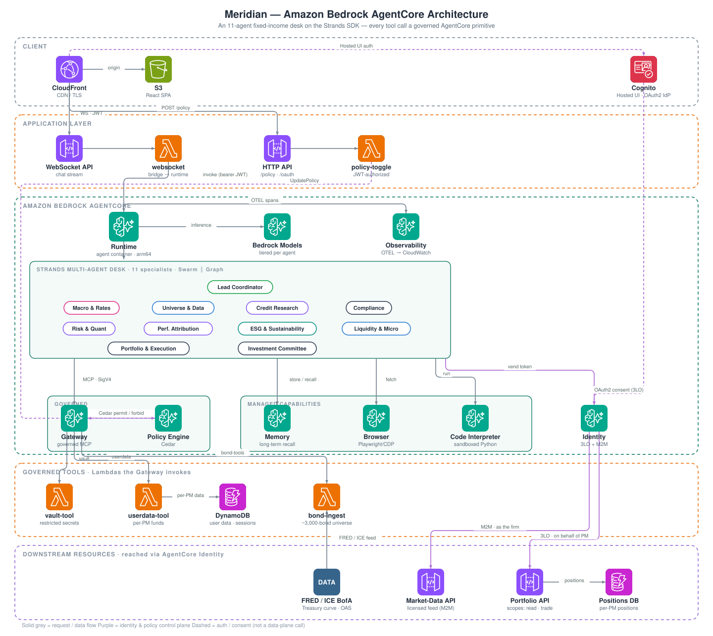

# AgentCore in a Box

> **A grab-and-go Amazon Bedrock AgentCore demo for the field.** One command deploys a
> governed, multi-agent financial-services platform you can put in front of a customer in
> minutes — every AgentCore primitive wired up, live, and traceable in CloudWatch.

**Codename:** *Meridian.* At login you pick a **desk** and the entire app — branding, agent
roster, tools, quick-prompts, seeded data, and theme — re-skins to that vertical, all on **one
shared AgentCore platform**. Same primitives underneath; only the desk on top swaps.

| Desk (persona) | Fictional firm | The multi-agent team → verdict |
|---|---|---|
| **Capital Markets** (default) | Meridian Asset Management | 11-agent fixed-income desk → **Investment Committee** |
| **Insurance** | Ridgeline Mutual | 11-agent P&C + Life underwriting desk → **Underwriting Committee** (bind) |
| **Banking** | Rampart Financial | 11-agent commercial-credit desk → **Credit Committee** (approve/decline) |
| **FinTech** | Kairo | 11-agent payments/risk desk → **Risk & Growth Council** (ship/hold) |

Each desk is a genuinely different set of specialists, system prompts, governed tools, and
data — selected per request by a `persona` field, in **one container image** (see
`agent/personas.py` + `agent/persona_*.py`).

> **The one-liner for the customer:** *"This is what a governed, auditable agentic system looks
> like on AWS — the agents are autonomous, but the controls are real."*

---

## What it demonstrates

Every desk showcases the same AgentCore primitives end-to-end:

| Primitive | What the demo shows |
|---|---|
| **Gateway** (MCP) | A Lambda tool exposed to the agent as an MCP tool, invoked over a SigV4-signed Gateway endpoint. Each vertical adds its own governed tool Lambda (`bond-tools` / `insurance-tools` / `banking-tools` / `fintech-tools`). |
| **Policy** (Cedar) | A live toggle that flips a Cedar `permit`/`forbid`. With it off, the agent genuinely **cannot** retrieve a restricted value it doesn't know — the block is real, not a prompt instruction. (Restricted trading list / bound-risk moratorium / sanctions-AML watchlist / fraud-ring blocklist, per desk.) |
| **Identity** | All three outbound credential modes: **3-legged (USER_FEDERATION) OAuth** with separate read/write consent (view positions vs. execute trade; view book vs. bind; view accounts vs. approve limit; view wallet vs. freeze/refund); **machine-to-machine (M2M / client_credentials)** where the agent authenticates as the *firm's licensed application* to a vendor feed (no user, no consent); and an **API-key vault** holding an outbound key (FRED) fetched at call time instead of living as a plaintext credential. Per-user data is keyed by the caller's verified Cognito `sub`. |
| **Browser** | Live web-page fetch via the AgentCore Browser (Playwright over CDP) — e.g. current US Treasury yields. |
| **Code Interpreter** | Python executed in the AgentCore sandbox — portfolio / actuarial / credit / unit-economics analytics per desk. |
| **Memory** | Long-term memory across sessions — store the user's mandate/appetite in one session, recall it in the next. |
| **Runtime** | The 11-specialist Strands multi-agent desk (Swarm **and** Graph topologies) runs as one arm64 container on the AgentCore Runtime, bearer-invoked over HTTPS. |
| **Evaluations** | Continuous online scoring of live turns (built-in evaluators **+** a custom **governance judge** — "did the agent refuse restricted data / respect entitlements") plus an on-demand "evaluate this turn" button. Scores land in CloudWatch and surface in the in-app Evaluations strip. |
| **Registry** | An IAM-authorized **AWS Agent Registry** cataloging the desk agents + the governed MCP tool surface, with a real admin **approval workflow** (records seed in DRAFT; submit → approve → deprecate) and semantic search. |
| **Harness** | *Meridian Express* — a **config-only** managed agent (model + system prompt + the SAME Gateway tools + the SAME Memory, declared as configuration, no container/orchestration code) invoked via `InvokeHarness`. The honest "config vs. code" companion to the hand-built Runtime swarm. |
| **Optimization** | Trace-driven **prompt recommendations** (optimized against the governance judge) + versioned **configuration bundles** + an **A/B experiment** (control vs. treatment, scored by online eval). The traffic split is **default-OFF**; an admin starts it explicitly. |

Everything is wired for **observability** (ADOT → CloudWatch GenAI Observability / X-Ray).

> **Primitive coverage: 12 of the 13 current AgentCore services.** Runtime, Gateway, Policy,
> Identity, Browser, Code Interpreter, Memory, Observability, **Evaluations, Registry, Harness,
> and Optimization** are all wired live. The one remaining service, **Payments** (x402
> microtransactions, still in preview), is the natural next addition for a payments-oriented desk.

---

## The governance story (the differentiator)

Financial-services buyers don't ask *"can it act?"* — they ask *"can I keep control?"* This
demo answers with an **admin-managed, fine-grained RBAC layer** enforced with **defense in
depth**. An admin (in the Cognito `admins` group) grants/revokes access to **users** (tools +
desks) and **agents** (outbound credential providers) from a live Admin Console; the change is
reflected in the target user's UI within ~1s and enforced server-side on their very next turn.

The same revocation is enforced at **four independent layers**, so no single bypass defeats it:

1. **Runtime pre-check** — the agent gates each tool/desk against the caller's *cryptographically
   verified* Cognito `sub` (never a self-asserted payload field). Primary per-user enforcement.
2. **Gateway request interceptor** — denies `tools/call` at the MCP boundary.
3. **Cedar per-tool blocklist** — a platform-level `forbid` (user-side kill-switch) that engages
   when a tool is revoked for everyone.
4. **IAM least-privilege backstop** — an inline `Deny` on the runtime role's
   `secretsmanager:GetSecretValue` for a revoked credential provider's backing secret. Because
   every 3LO/M2M/API-key vend reads that secret *as the runtime role*, the vend fails at the AWS
   control plane even if all the runtime code were bypassed (agent-side kill-switch).

The impersonation angle is closed too: the runtime verifies the in-band user token against
Cognito JWKS and takes identity from verified claims. See `agent/entitlements.py` (the single
source of truth for the catalog + decision logic) and `lambda/admin-api/`.

Two operator surfaces make the model legible and actionable: a **Governance Graph** (the live
who-can-reach-what read model, with kill-switch-engaged edges badged) and a self-service
**request → approve** workflow (separation of duties — the requester is never the approver). See
[docs/GOVERNANCE_MODEL.md](docs/GOVERNANCE_MODEL.md).

---

## Architecture



- **CDK (TypeScript)** provisions: Cognito, DynamoDB (user data, entitlements, WS connections),
  the WebSocket + HTTP APIs, the Lambdas, the ECR repo, and the S3 + CloudFront frontend.
- **`deploy.sh`** runs `cdk deploy`, then creates the AgentCore resources that have no mature CDK
  constructs yet (Runtime, Gateway + targets, Memory, Policy Engine, Browser, Code Interpreter,
  Identity providers) via the `bedrock-agentcore-control` CLI, builds/pushes the agent container,
  wires resource IDs into the Lambdas/runtime, and writes the frontend config.
- The agent is an **11-specialist Strands multi-agent desk** (Swarm and Graph topologies) over one
  shared tool layer. Regenerate the diagram with `python3 docs/gen_diagram.py`.

The split exists because AgentCore primitives aren't yet first-class CDK L2 constructs.

---

## Prerequisites

- **AWS account** with permissions to create the resources above, and an AWS CLI profile
  configured (`aws configure` / `aws sso login`).
- **Amazon Bedrock model access** in your target region for:
  - `anthropic.claude-haiku-4-5` (the default agent model)
  - `anthropic.claude-sonnet-4-6` (used by Memory extraction strategies)
  - `amazon.nova-2-lite` and `openai.gpt-oss-120b` (optional — the UI can switch the agent to
    these per session; skip if you won't demo model switching)

  Enable these under **Bedrock → Model access** before deploying.
- **Node.js 20+** and **AWS CDK** (`npx cdk` is used; no global install required).
- **Docker or Finch** — the agent runs as an **arm64** container image. The build uses
  `--platform linux/arm64`, so on an x86 host you need emulation (`docker buildx` / `qemu`, or
  Finch which handles it).
- **AWS CLI v2 ≥ 2.35** and **`jq`.** The CLI floor matters: older CLIs silently no-op the
  AgentCore policy/interceptor operations, leaving the Cedar governance layer un-provisioned.
- A region where AgentCore is available (default `us-west-2`).

---

## Deploy

```bash
# 1. Install CDK dependencies
npm install

# 2. Point at your account/region (the scripts read these — nothing is hardcoded)
export AWS_REGION=us-west-2
export CDK_DEFAULT_ACCOUNT=$(aws sts get-caller-identity --query Account --output text)
export CDK_DEFAULT_REGION=$AWS_REGION

# 3. First time only: bootstrap CDK in this account/region
npx cdk bootstrap

# 4. Deploy everything
./deploy.sh
```

`deploy.sh` prints the **CloudFront URL** at the end — open it in a browser. (Hard-refresh if you
redeploy; CloudFront caches the frontend.)

### Isolated, collision-free environments

Every resource is namespaced with an environment suffix, so the demo can be deployed **multiple
times in one account** (or across many accounts) without name collisions:

- On first deploy, a unique suffix is generated and saved to `.demo-env` (gitignored). Re-running
  `deploy.sh` reuses it, so updates land on the *same* environment.
- To run a second, separate instance in the same account, deploy from a different checkout, or set
  an explicit name: `DEMO_ENV=alice ./deploy.sh`.
- `cleanup.sh` reads the same `.demo-env` (or `DEMO_ENV`) to tear down exactly that instance, then
  clears `.demo-env` so the next deploy starts fresh.

### Demo users

`deploy.sh` creates two users per desk (all password `Demo1234`) plus an admin, in one shared
Cognito pool. Per-user data is keyed by the caller's Cognito `sub`, so the two users on each desk
see different books:

| Desk | Users | Books managed |
|---|---|---|
| **Capital Markets** | `alice@demo.com`, `bob@demo.com` | Core Bond / Short Duration / Government Securities funds |
| **Insurance** | `uw1@demo.com`, `uw2@demo.com` | Coastal & Middle-Market Property / Umbrella & Group Life books |
| **Banking** | `rm1@demo.com`, `rm2@demo.com` | Commercial & Industrial / Small Business / Commercial Real Estate books |
| **FinTech** | `ops1@demo.com`, `ops2@demo.com` | Consumer Wallet / Prepaid & SMB Card programs |
| **Admin** | `admin@demo.com` | In the `admins` group — unlocks the Access Control console |

Login uses the **Cognito Hosted UI** (sign in once; the 3-legged consent step reuses that
session). The desk you pick at login is remembered client-side and sent with every turn; you can
also switch desks from the header dropdown after signing in (it starts a fresh session).

### Observability (optional)

After `deploy.sh`, enable vended-log/trace delivery for the non-runtime resources:

```bash
./enable-observability.sh   # reads resource IDs from the deployment's outputs file
```

Then view traces in **CloudWatch → GenAI Observability → Bedrock AgentCore**. Requires CloudWatch
**Transaction Search** to be enabled in the account.

---

## Running the demo

Use the Quick Prompt buttons in the UI. For the full story-driven walkthrough and talking points:

- [`docs/SA_DEMO_GUIDE.md`](./docs/SA_DEMO_GUIDE.md) — the field SA's guide (who it's for, why an FS
  customer cares, what to say).
- [`docs/DEMO_NARRATIVE.md`](./docs/DEMO_NARRATIVE.md) — the scripted narrative and per-primitive beats.
- [`DEMO_RUNBOOK.md`](./DEMO_RUNBOOK.md) — the quick operational runbook.

Three headline moments:

1. **Policy guardrail** — ask **"What's on the firm's restricted trading list right now?"**; the
   agent returns it via the Gateway/Secure Vault tool. Flip the **Secure Vault** toggle **off**
   (Cedar `forbid`) and ask again — the agent is blocked by policy and **cannot** produce it. The
   value lives only in the Lambda, so the model can't fake it. Flip back on when done.
2. **Identity 3-legged OAuth** — "Show me the positions in my Core Bond Fund" triggers a one-time
   consent; the agent then acts **on the PM's behalf** against the Portfolio API. Executing a
   trade requires a *separate* trade consent (read consent can't escalate to trade), and every
   execution is audit-logged with the PM, instrument, side, and before/after allocation.
3. **Admin governance** — sign in as `admin@demo.com`, open **Access Control**, and revoke a tool
   from `alice` (or a credential from an agent). Watch alice's UI update live, then watch the
   revoked action get blocked server-side on her next turn — enforced at all four layers.

You can also switch the LLM per session (Claude Haiku / Nova 2 Lite / GPT-OSS 120B) and open
multiple session tabs (shared long-term memory, isolated short-term).

### Async long-running jobs

The runtime supports a **background-task pattern** (`phase='start'` / `phase='poll'`) that keeps a
session's microVM alive so a desk can "run autonomously for hours" without holding the WebSocket
open — see the async section in `agent/main.py` and `lambda/websocket/index.py`.

---

## Teardown

```bash
./cleanup.sh   # deletes AgentCore resources, then runs `cdk destroy`
```

This removes the runtime/endpoint, gateway + targets, memory, policy engine, browser, code
interpreter, and the credential providers, then destroys the CDK stack (the ECR repo is emptied
automatically via `emptyOnDelete`).

---

## Project layout

```
bin/agent_core.ts        CDK app entry (reads CDK_DEFAULT_ACCOUNT/REGION)
lib/agent_core-stack.ts  CDK stack: Cognito, APIs, Lambdas, ECR, S3/CloudFront
deploy.sh                Full deploy: CDK + AgentCore CLI resources + container build
cleanup.sh               Full teardown
enable-observability.sh  Wire vended logs/traces for gateway/memory/code-interpreter
agent/                   Agent container: main.py, personas + persona_*.py, entitlements.py,
                         Strands swarm/graph topologies, Dockerfile, requirements.txt
lambda/
  websocket/             Canonical chat handler (WebSocket API; bearer HTTPS invoke; async start/poll)
  admin-api/             Admin RBAC control plane: entitlements writes + Cedar (cedar.py) and
                         IAM (iam_creds.py) re-materialization — the ONLY writer to the table
  gateway-interceptor/   MCP request interceptor: denies tools/call at the Gateway boundary
  policy-toggle/         Cedar permit/forbid toggle (HTTP /policy/toggle, JWT-authorized)
  vault-tool/            Gateway tool: restricted values only the Lambda knows (restricted list, etc.)
  userdata-tool/         Gateway tool: per-user data from DynamoDB
  grades-api/            Downstream 3LO resource: Portfolio API GET positions / PUT trade
  market-data-api/       Downstream M2M resource: licensed vendor feed (market-data/read scope)
  {banking,fintech,insurance,bond}-tools/    Per-desk governed tool Lambdas (MCP)
  {banking,fintech,insurance,bond}-ingest/   Per-desk seed-data ingestion
  oauth-callback/        3LO consent callback (completes the user-delegated token grant)
  demo-reset/            Operator Lambda (no route): wipe memories + reset positions to baseline
frontend-react/          React chat UI + Admin Console (config generated by deploy.sh)
docs/                    SA_DEMO_GUIDE.md, DEMO_NARRATIVE.md, architecture diagram + generator
test/                    CDK synth smoke tests (npm test)
```

---

## Security notes

This demo favors clarity over least privilege. The **governance layer is real** (the four
enforcement points above are genuine control-plane guarantees), but the surrounding scaffolding is
demo-grade. Before adapting it:

- **IAM**: the runtime and policy-toggle roles use `bedrock-agentcore:*`, and the gateway role
  allows `lambda:InvokeFunction` on `*`. Scope these to specific resource ARNs. (The admin-api's
  IAM permission is already scoped to exactly the runtime role — Get/Put/Delete inline policy only,
  no `PassRole`/`AttachRolePolicy`.)
- **CORS** on the HTTP API is `allowOrigins: ['*']`. Restrict to your CloudFront domain.
- **Cognito** password policy is relaxed and self sign-up is disabled (admin-created users only).
- The Code Interpreter tool has a **local `exec()` fallback** in `agent/main.py` that runs
  model-generated Python inside the container if the sandbox is unavailable. It's flagged in the
  code; remove it for any non-demo use.
- Secrets in `lambda/vault-tool` are hardcoded for the demo. Real secrets belong in AWS Secrets
  Manager / Parameter Store.

> ⚠️ **This is a demo, not production.** See the notes above before reusing.
