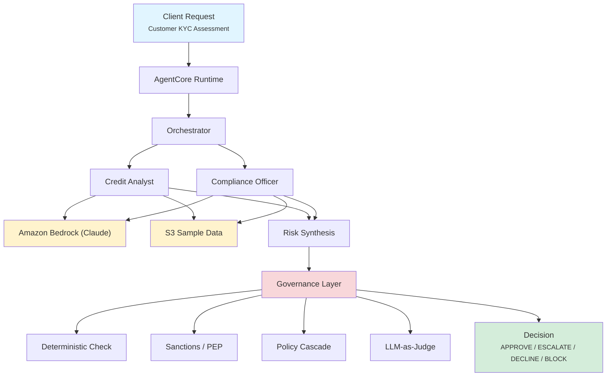

# KYC - Controlled Quality Output

Governed Know Your Customer assessment for corporate banking onboarding. Two
specialist agents (Credit Analyst, Compliance Officer) produce credit and
compliance findings, and then a **non-bypassable governance layer** applies four
deterministic controls to reach the final decision. Even when the agents
recommend approval, a hard governance gate (a sanctions match, a prohibited
jurisdiction) can block the onboarding.

This use case builds on `kyc_banking` — the core agentic assessment is the same
— and adds the governance layer that makes the AI decision auditable and
non-bypassable.

## What the governance layer adds

| Control | What it does | Effect on decision |
|---|---|---|
| **Deterministic financial check** | Recomputes financial ratios (D/E, current ratio, net margin, on-time-payment %) from the raw statements and compares them to the agent's claimed values. | Catches hallucinated/mis-stated numbers; a FAIL raises risk. |
| **Sanctions / PEP screening** | Fuzzy-matches the entity name against OFAC/OFSI + PEP watch lists. | A sanctions match ≥ 0.70 forces **BLOCK** (ORG-001); a PEP match forces **ESCALATE** (ORG-004). |
| **Policy cascade (ORG → APP → REQ)** | Evaluates three layers, most-restrictive-wins (BLOCK > ESCALATE > ALLOW). | Produces the final decision + the deciding rule. |
| **LLM-as-Judge** | Scores the agent's write-up on 5 quality dimensions (Bedrock Claude Haiku). | Quality/audit signal; does not gate the decision. |

Final decision is one of **APPROVE / ESCALATE / DECLINE / BLOCK**. A BLOCK or
ESCALATE produces an incident/escalation ID and records the deciding policy layer.

## Architecture



The four controls are deployed as independent AWS services (HTTP API → Lambda)
under `deploy/governance/`. The orchestrator calls them via five environment
variables. **When those variables are unset, the orchestrator falls back to an
equivalent in-process implementation** with identical thresholds — so the use
case runs standalone (like `kyc_banking`) and the governance services are an
additive companion stack.

### Directory Structure

```
use_cases/kyc_governance_insights/
├── README.md
├── deploy/
│   └── governance/                  # companion governance services (see deploy/governance/README.md)
│       ├── deploy_all.sh            # deploy all 4 stacks + seed DynamoDB + print URLs
│       ├── deterministic-check/     # lambda_function.py + template.yaml
│       ├── sanctions-pep/           # + seed_lists.json / seed_lists.py (DynamoDB watch lists)
│       ├── policy-cascade/
│       └── llm-judge/
└── src/
    ├── __init__.py                  # framework router (AGENT_FRAMEWORK)
    ├── langchain_langgraph/
    │   ├── config.py  models.py  orchestrator.py
    │   ├── governance.py            # client for the 4 services + in-process fallbacks
    │   ├── governance_pipeline.py   # run_governance() + assemble_response()
    │   └── agents/{credit_analyst,compliance_officer}.py
```

## Governance thresholds

- Sanctions fuzzy match ≥ **0.70** → BLOCK; PEP match ≥ **0.60** → ESCALATE
- Risk score ≥ **60** → ESCALATE, ≥ **80** → BLOCK
- Deterministic tolerances: ratios ±0.05, net margin ±0.01, payment % ±1.0

These live in `src/*/governance.py` and are mirrored by the deployed services.

## Sample Data

Ten corporate customers under `data/samples/kyc_governance_insights/`, each with
`profile.json`, `credit_history.json`, `transactions.json`, `compliance.json`.
The financials are internally consistent (the agent's claimed ratios equal what
the deterministic check recomputes), so honest customers pass the check.

| Customer | Decision | Driver |
|---|---|---|
| `CUST001` Acme Corporation | APPROVE | Clean; low risk (20) |
| `CUST002` Al-Rashid Trading | APPROVE | Elevated geo risk, resolved by monitoring (44) |
| `CUST003` Meridian Pension Trust | APPROVE | FCA-regulated, low risk (18) |
| `CUST004` Kensington Holdings | ESCALATE | PEP Level 1 (ORG-004) |
| `CUST005` Northgate Industrial | DECLINE (credit) | Extreme leverage / defaults |
| `CUST006` Pacific Ventures BVI | ESCALATE | Shell-company indicators, risk 71 |
| `CUST007` GlobalFX Solutions | APPROVE | High-volume MSB, licensed (35) |
| `CUST008` Volkov Enterprises | **BLOCK** | OFAC SDN match (ORG-001) |
| `CUST009` Syria Relief Foundation | ESCALATE | FATF/conflict-zone ops (ORG-005) |
| `CUST047` Omega Trading Ltd | **BLOCK** | OFSI sanctions match on UBO (ORG-001) |

## Request / Response

```python
class AssessmentRequest(BaseModel):
    customer_id: str                          # e.g. "CUST001"
    assessment_type: AssessmentType = "full"  # full | credit_only | compliance_only
    additional_context: str | None = None
```

`AssessmentResponse` extends the base KYC response with the governance fields:
`decision`, `risk_score`, `risk_level`, `sanctions`, `deterministic_checks`,
`policy_cascade` (list of `{layer, rule, result, reason}`), `judge_scores`,
`blocked`, `block_reason`, `incident_id`, `policy_layer`.

## Deploy

### 1. Deploy the use case (standard Foundry flow)

```bash
# From applications/fsi_foundry
USE_CASE_ID=kyc_governance_insights ./scripts/deploy/full/deploy_agentcore.sh
```

This deploys the AgentCore runtime + agent exactly like any other use case (it
inherits the plain-image-tag fix). Without the governance services, the use case
runs with in-process governance fallbacks.

### 2. (Optional) Deploy the companion governance services

```bash
cd use_cases/kyc_governance_insights/deploy/governance
./deploy_all.sh --prefix kyc-gov --region us-east-1
```

This deploys all four CloudFormation stacks, seeds the sanctions/PEP DynamoDB
tables, and prints the five function names. See `deploy/governance/README.md` for
details and per-service deploy commands.

### 3. Wire the function names into the runtime

The governance services have no HTTP endpoint: the runtime invokes them directly
with `lambda:InvokeFunction` and IAM is the only thing that authorises the call.
Pass the function names printed by `deploy_all.sh` as Terraform variables on the
runtime module, or set `governance_ssm_prefix` and let it resolve them from SSM:

```
deterministic_check_function = "kyc-gov-deterministic-check"
sanctions_check_function     = "kyc-gov-sanctions-check"
pep_check_function           = "kyc-gov-sanctions-check"
policy_cascade_function      = "kyc-gov-policy-cascade"
llm_judge_function           = "kyc-gov-llm-judge"
```

Sanctions and PEP resolve to the same function — it performs both screenings
against separate lists and thresholds, selected by the `check` field in the
request payload.

They default to empty (safe for all other use cases); when set, the container
sees `DETERMINISTIC_CHECK_FUNCTION`, `SANCTIONS_CHECK_FUNCTION`, `PEP_CHECK_FUNCTION`,
`POLICY_CASCADE_FUNCTION`, and `LLM_JUDGE_FUNCTION`.

### 4. Deploy the UI

The React UI lives at `applications/reference_implementations/kyc-governance-insights/ui/`. It
renders the full governance layer (decision badge, risk level, sanctions/PEP,
deterministic-check table, policy-cascade trace, LLM-judge scores, and the
BLOCK/ESCALATE banner). Deploy it with the standard UI flow.

## Registry

Registered as **B11** (Banking) in both
`data/registry/offerings.json` and
`platform/control_plane/frontend/public/offerings.json`. Resource short-name
`kycgov` (`foundations/iac/agentcore/infra/main.tf`).

## Related Documentation

- [Governance services](deploy/governance/README.md)
- [Platform Overview](../../docs/foundations/README.md)
- [Deployment Guide](../../docs/foundations/deployment/deployment_patterns.md)
