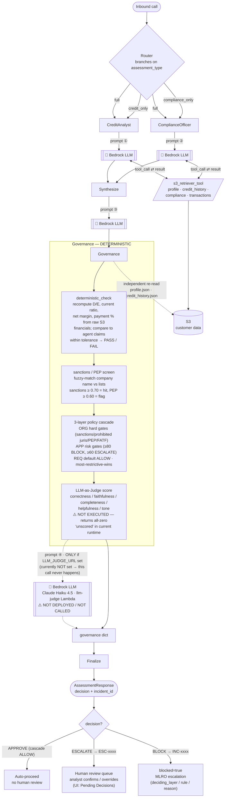
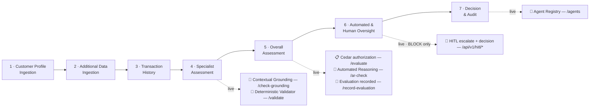

# KYC Controlled Quality Output — Assessment Flow

> **This use case has two layers.** The diagram and prompts below describe the
> **assessment engine** — the AgentCore runtime graph that actually produces the
> decision. Separately, a **live verification layer** of independently deployed
> console-service APIs is called by the Basic-mode walkthrough, step by step, to
> prove each governance control against a real AWS backend. That layer — and
> exactly when each control fires — is documented in
> [Live verification layer — what fires when](#live-verification-layer--what-fires-when).



## Prompts

**① CreditAnalyst** (`analyze_credit_risk`, input to `ainvoke`):

```
Perform a comprehensive credit risk analysis for corporate customer: {customer_id}

Steps to follow:
1. Retrieve the customer's profile data using the s3_retriever_tool with data_type='profile'
2. Retrieve credit history using the s3_retriever_tool with data_type='credit_history'
3. Retrieve transaction history using the s3_retriever_tool with data_type='transactions'
4. Analyze all retrieved data and provide a complete credit risk assessment

{Additional Context: <context> if provided}

Provide your complete analysis including risk score, risk level, key factors, and recommendations.
```

**② ComplianceOfficer** (`check_compliance`, input to `ainvoke`):

```
Perform a comprehensive KYC/AML compliance check for corporate customer: {customer_id}

Steps to follow:
1. Retrieve the customer's profile data using the s3_retriever_tool with data_type='profile'
2. Retrieve compliance records using the s3_retriever_tool with data_type='compliance'
3. Retrieve transaction history using the s3_retriever_tool with data_type='transactions'
4. Analyze all retrieved data and provide a complete compliance assessment

{Additional Context: <context> if provided}

Provide your complete compliance assessment including status, checks passed/failed, regulatory notes, and required actions.
```

**③ Synthesize** (`_synthesize_node`, input to structured-output `ainvoke`):

```
You are a Senior Risk Assessment Supervisor. Based on the following specialist
assessments, produce a structured KYC assessment.

## Credit Risk Analysis
{credit_analysis JSON}

## Compliance Assessment
{compliance_check JSON}

Fill in all fields based on the agent assessments above. Use actual findings,
scores, and details — not generic defaults.
```

> Synthesize calls Bedrock with `with_structured_output(KYCSynthesisSchema)` (no tools). On exception it falls back to `self.synthesize()`, which prepends the orchestrator's `system_prompt`.

**④ LLM-as-Judge** (llm-judge Lambda, `EVAL_PROMPT`, Claude Haiku 4.5 via `invoke_model`):

```
You are an evaluation judge for a KYC (Know Your Customer) risk assessment system.

Evaluate the following agent output against these 5 criteria. Score each 0.0 to 1.0:

1. **Correctness**: Are the facts, numbers, and conclusions accurate?
2. **Faithfulness**: Does the output stay true to the source data without hallucination?
3. **Completeness**: Does it cover all required checks (sanctions, PEP, credit, UBO, adverse media)?
4. **Helpfulness**: Is it actionable for a compliance analyst making an onboarding decision?
5. **Tone**: Is it professional, neutral, and appropriate for regulatory documentation?

AGENT OUTPUT:
{agent_output}   ← the synthesis summary, truncated to 4000 chars

Respond ONLY with valid JSON (no markdown):
{"correctness": 0.0, "faithfulness": 0.0, "completeness": 0.0, "helpfulness": 0.0, "tone": 0.0}
```

> ⚠️ This Bedrock call only happens when `LLM_JUDGE_URL` points at the deployed llm-judge Lambda. The Lambda exists in `deploy/governance/llm-judge/` but is **not deployed** in the current runtime, so `llm_judge()` takes its in-process fallback and returns all-zero scores flagged `"unscored (judge url not configured)"` — no Bedrock call is made. The judge score is quality-assurance only; it never gates the decision.

## What the "governance dict" is

The object returned by `run_governance()` — the raw output of all four deterministic
controls, later mapped into the typed `AssessmentResponse` by `assemble_response()`:

```python
{
  "sanctions":     { matched, score, matched_name, list, entry_id, threshold },
  "pep":           { matched, score, matched_name, list, level, threshold },
  "deterministic": { overall: PASS|FAIL, checks: [ {metric, computed, agent_stated, result} ] },
  "risk_score":    int,          # agent score, bumped to ≥81 on sanctions hit / ≥65 on FAIL
  "cascade":       { decision: BLOCK|ESCALATE|ALLOW, deciding_layer, deciding_rule,
                     reason, evaluations: [...] },   # this drives the final decision
  "judge":         { correctness, faithfulness, completeness, helpfulness, tone, model },
  "company_name":  str,
}
```

**Finalize** (`assemble_response`) maps `cascade.decision` → `APPROVE` / `ESCALATE` / `BLOCK`
(DECLINE for non-compliant), attaches the risk score/level, sanctions, deterministic
checks and judge scores, and returns the typed `AssessmentResponse`.

## Human-in-the-loop

There is **no blocking interrupt node** — the graph does not pause mid-run to wait for a
human. Instead, `assemble_response` ([lines 244-258](../src/langchain_langgraph/governance_pipeline.py))
emits a decision + `incident_id` that determines whether a human is pulled in **after** the
run returns:

| decision | signal set | human involvement |
|----------|-----------|-------------------|
| **APPROVE** (cascade ALLOW) | — | none — auto-proceeds |
| **ESCALATE** | `incident_id = "ESC-xxxx"` | routed to the review queue; an analyst confirms or overrides (UI: *Pending Decisions*) |
| **BLOCK** | `blocked=true`, `incident_id = "INC-xxxx"`, `block_reason`, `policy_layer` | MLRO escalation; onboarding halted pending sign-off |

The confirmation is a **downstream, asynchronous** step (a human working the incident/queue),
not a synchronous gate inside the assessment call.

---

# Live verification layer — what fires when

The engine above runs server-side inside the AgentCore runtime. On top of it sits a
**live verification layer**: a set of independently deployed **console-service** APIs
that the Basic-mode walkthrough (`BasicModeView.tsx`) calls, step by step, to prove the
same governance controls against real AWS backends.

These calls are **additive and fire-and-forget** — each lights up a "verified live"
badge but never changes the scripted narrative, dials, or telemetry. If a call fails
(offline / CORS / timeout) the badge simply doesn't appear, so the demo never breaks.
Every call sends `x-api-key` + `x-tenant-id` and reads its endpoint from
`public/runtime-config.json` → `console_services.*`.

## Step timeline

The walkthrough has an intro (architecture) step, then 7 assessment steps. Live calls
are keyed to the step index and **persist once fired** (a badge lit at step 4 stays lit
through step 7).



| Step | What the engine does | Live control(s) that fire | Endpoint (config key · route) |
|------|----------------------|---------------------------|-------------------------------|
| 1 · Customer Profile Ingestion | Both agents fetch the profile from the S3 data store | — (dials/telemetry staged) | — |
| 2 · Additional Data Ingestion | Credit Analyst pulls credit history; Compliance Officer pulls the compliance record | — | — |
| 3 · Transaction History Ingestion | Both agents read transactions; composite risk forms | — | — |
| **4 · Specialist Assessment** | Agents stop calling tools and finalise their verdicts | **Contextual Grounding** + **Deterministic Validator** | `grounding_api_url` · `POST /check-grounding` · and `validator_api_url` · `POST /validate` |
| **5 · Overall Assessment** | Supervisor synthesises both verdicts; policy decision is reached | **Cedar authorization** + **Automated Reasoning** + **Evaluation recorded** | `cedar_api_url` · `POST /evaluate` · `POST /ar-check` · and `eval_write_api_url` · `POST /record-evaluation` |
| **6 · Automated & Human Oversight** | Deterministic governance re-checks; escalates if a gate fires | **HITL escalate / decision** *(BLOCK scenario only)* | `hitl_api_url` · `POST /api/v1/hitl/escalate` then `/decision` |
| **7 · Decision & Audit** | Decision committed; evidence pack + audit trail sealed | **Agent Registry** (owner + autonomy tier) | `registry_api_url` · `GET /agents` |

## Component details

### 📐 Contextual Grounding — `grounding_api_url POST /check-grounding`
- **Fires:** step 4 onward. **Backend:** Bedrock Guardrails (`ApplyGuardrail`), guardrail `65pg7uyusr0e` v1.
- **Request:** `{ grounding_source, query, response_text }`.
- **Response:** `{ action: NONE|GUARDRAIL_INTERVENED, grounding_score, relevance_score, grounded, thresholds }` (GROUNDING ≥ 0.85, RELEVANCE ≥ 0.75).
- **Proves:** the assessment text is factually supported by the source. A hallucinated Omega response ("under active OFAC sanctions, £900M revenue") is caught — `GUARDRAIL_INTERVENED`, grounding ≈ 0.04.
- **Note:** for the grounded example, `relevance_score` is model-dependent and can fall below 0.75 even when grounding is 1.0, which shows as intervened. Tunable via the relevance threshold.

### 🔢 Deterministic Validator — `validator_api_url POST /validate`
- **Fires:** step 4 onward. **Backend:** a non-AI Lambda (`kyc-deterministic-validator`) — no model, no stored result.
- **Request:** `{ raw, claimed }`. Recomputes `debt_to_equity = liabilities/equity`, `current_ratio = current_assets/current_liabilities`, `payment_history_pct = on_time/total`; thresholds D/E < 3.0, current > 1.0, payment > 90%.
- **Response:** `{ verdict PASS|FAIL, recomputed, checks[], mismatches[], checked, engine }`.
- **Proves:** the figures are genuine arithmetic, not an LLM-emitted number. Acme D/E 0.33 → PASS, Omega 5.43 → FAIL; a fabricated claim surfaces as a `mismatch`.

### 📋 Cedar Authorization — `cedar_api_url POST /evaluate`
- **Fires:** step 5 onward. **Backend:** Verified Permissions `is-authorized` against policy store `W6W7qxQ1PRUQDffhQTZJVK` (19 policies: 3-layer cascade + the `DEFAULT-001` base permit).
- **Request:** the full is-authorized shape (`principal`, `action`, `resource`, `context`, `entities`).
- **Response:** `{ decision ALLOW|DENY, reasons[] }` where `reasons` are the determining policy IDs.
- **Proves:** the decision is real external authorization. Acme → `ALLOW` (DEFAULT-001 permit, no forbid). Omega → `DENY` (ORG-003 sanctions > 85 and ORG-004 PEP ≥ 3 forbids fire; reasons populated).

### 🧮 Automated Reasoning — `cedar_api_url POST /ar-check`
- **Fires:** step 5 onward. **Backend:** Bedrock (`ApplyGuardrail`/`GetGuardrail`) on the cedar-proxy. *(This route needs `bedrock:ApplyGuardrail` on the cedar-proxy role — the IAM fix deployed in this migration; it was the root cause of the earlier `/ar-check` 500.)*
- **Request:** `{ text, sources }`. **Response:** `{ verdict VALID|INVALID|INSUFFICIENT_DATA, violations[], checkedRules, latencyMs }`.
- **Proves:** the agent's claims are logically consistent with the source documents.

### 📝 Evaluation Recording — `eval_write_api_url POST /record-evaluation`
- **Fires:** step 5 onward, once the Cedar result is known — **fire-and-forget**, no visible change. **Backend:** registry-proxy → DynamoDB. `eval_write_api_url` falls back to `registry_api_url` if unset (both are the same registry proxy here).
- **Request:** `{ scenario, verdict, confidence, checks_passed[], checks_failed[], grounding_score, ar_verdict, model_id, agent_id, ... }` — the genuinely computed signals from the live calls above.
- **Proves:** each run persists a real evaluation record (surfaced in the Advanced console's Evaluations tab).

### 👤 Human-in-the-Loop — `hitl_api_url POST /api/v1/hitl/escalate` + `/decision`
- **Fires:** step 6, **BLOCK scenario only**. Escalate on entering the step; `/decision` on the presenter's APPROVE/REJECT click. **Backend:** DynamoDB `hitl-pending-reviews` + `hitl-audit-log`.
- **Escalate:** `{ case_id, customer, risk_score, reason, recommended_action }`. **Decision:** `{ case_id, decision, reviewer, reason }`.
- **Proves:** the escalation and the human decision are written to a real audit store. `GET /api/v1/hitl/pending` drives the Advanced Review Queue.

### 📇 Agent Registry — `registry_api_url GET /agents`
- **Fires:** step 7. **Backend:** DynamoDB `kyc-agent-registry`.
- **Returns:** the registered agents (orchestrator, credit-analyst, compliance-officer, sanctions-screener, audit-agent) with `tier`, `owner`, `escalation_to`, `runtime`.
- **Proves:** the accountable owner and earned autonomy tier shown on the decision are real registry data, not a label.

## Real vs staged — read this before demoing

- **Live (real backend, drives the badges):** Contextual Grounding, Deterministic Validator, Cedar authorization, Automated Reasoning, Evaluation recording, HITL, Agent Registry.
- **Staged (illustrative values only):** the confidence dials (Accuracy / Security / Compliance / Product / Legal), token spend, and the telemetry lines — including **"LLM-Judge quality: 0.95"**. There is **no live LLM-judge call** in the walkthrough. The governance LLM-judge Lambda (`deploy/governance/llm-judge`) is **not deployed** in this account (deferred), so the engine's `llm_judge()` still takes its in-process fallback unless `LLM_JUDGE_URL` is set (see prompt ④ above).

## Deployed endpoints — account 446224796353 · us-east-1

Referenced by config key in this doc for portability; the concrete API IDs below are
account-specific and will differ in any other deployment.

| Control | config key(s) | API id | routes |
|---------|---------------|--------|--------|
| Cedar authorization + Automated Reasoning | `cedar_api_url` | `hf87s4kwmk` | `/evaluate`, `/ar-check`, `/policies`, `/traces`, `/health` |
| Contextual grounding | `grounding_api_url` | `w8749wujod` | `/check-grounding`, `/health` |
| Deterministic validator | `validator_api_url` | `7ghqhc46ce` | `/validate` |
| Registry + evaluations | `registry_api_url`, `eval_write_api_url` | `y2qtgiaujj` | `/agents`, `/evaluators`, `/results`, `/evaluations`, `/record-evaluation`, `/evaluate`, `/health` |
| Human-in-the-loop | `hitl_api_url` | `j64az3x7g7` | `/api/v1/hitl/pending`, `/decision`, `/escalate` |
| Agent-runtime metrics | `metrics_api_url` | `dfa5nbg508` | (metrics proxy) |

Supporting resources: Bedrock guardrail `65pg7uyusr0e` v1 (contextual grounding);
DynamoDB `hitl-pending-reviews` + `hitl-audit-log`; Cedar policy store
`W6W7qxQ1PRUQDffhQTZJVK` (19 policies). All deployed via
`deploy/console-services/*` (see `deploy_all.sh`), except the guardrail and HITL
tables which are created out-of-band (CLI) because an account-level CloudFormation
hook blocks those resource types.
