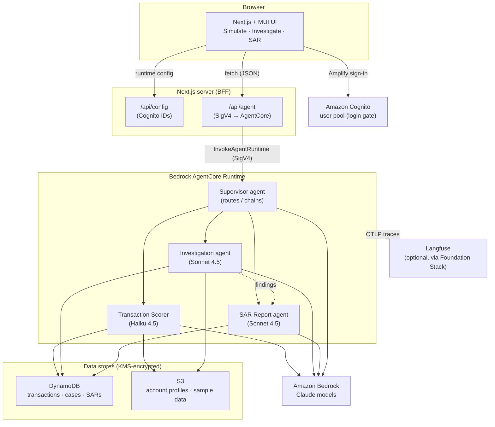

# Architecture

System architecture for the Payments Fraud reference implementation. The Mermaid
below is the canonical source and renders inline on GitLab/GitHub.

Key points:
- The browser never holds AWS credentials. The **Next.js BFF** (`/api/agent`) invokes
  the AgentCore runtime server-side with **SigV4**.
- **Cognito** gates *login* to the UI; it is not in the request path to the agent.
- A **supervisor** agent routes each request to one of three specialists (and chains
  investigation → SAR). All run on **Bedrock AgentCore** via the Strands SDK.

> Note: this reference implementation runs the frontend locally (`npm run dev`). A
> production-facing deployment would additionally host the BFF (e.g. Amplify Hosting /
> ECS) behind CloudFront and could switch the runtime to validate Cognito JWTs directly.
