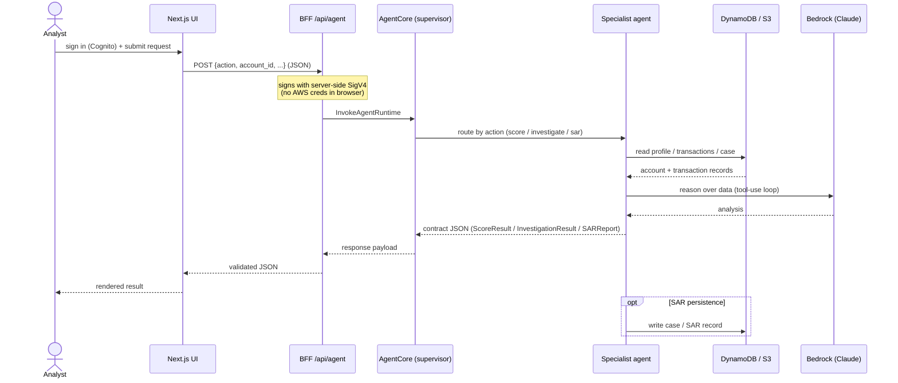
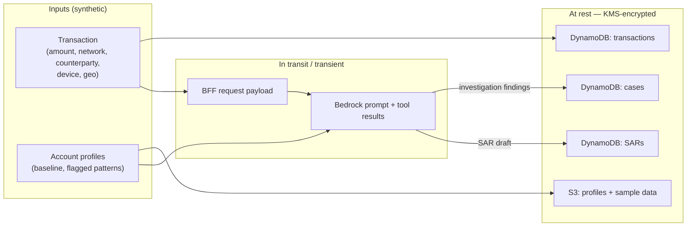

# Data Flow

How payment data moves through the system, and where it is stored. All data in this
reference implementation is **synthetic** (see [`../../data/README.md`](../../data/README.md));
there is no real PII.

## Request sequence (score / investigate / SAR)

The three user actions share one path: browser → BFF → AgentCore → tools → Bedrock.
The supervisor routes by the `action` field; investigation findings can feed the SAR.

## Data classification & storage

Notes:
- **At rest:** DynamoDB tables and the S3 bucket are encrypted with a customer-managed
  KMS key; S3 blocks public access and is versioned.
- **In transit:** browser↔BFF over HTTPS (in a hosted deployment); BFF↔AgentCore and
  agent↔Bedrock over AWS SigV4-signed TLS.
- **Human-in-the-loop:** the SAR agent only drafts reports
  (`filing_recommendation` defaults to `needs_human_review`); nothing is filed
  automatically.
- **Observability:** when Langfuse is configured, agent traces (prompts, tool calls)
  are exported via OTLP — be mindful that traces can contain request content.
