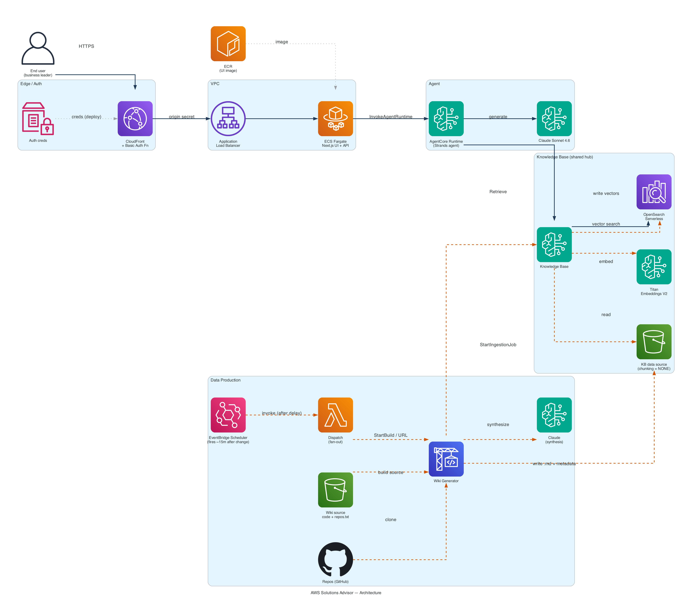

# AWS Solutions Advisor (Sales Recommend)

**An AI-powered solution recommendation agent for non-technical business leaders, deployed on AWS Bedrock AgentCore.**

Part of the [AVA — Agentic Value Accelerator](https://github.com/aws-samples/sample-agentic-value-accelerator) ecosystem.

---

## What It Does

A conversational agent that helps business decision-makers find the right pre-built AWS solution from a curated catalog. Speaks in plain English, leads with business outcomes, and uses interactive choices and structured highlights to guide the conversation.

## Architecture

```
User → CloudFront (Basic Auth) → ALB → ECS Fargate (Next.js) → AgentCore → Claude + KB
                                                                              │
                       Bedrock Knowledge Base ──▶ OpenSearch Serverless (vectors)
                                  ▲
   repos.txt → EventBridge Scheduler (~15m) → Dispatch Lambda → CodeBuild (per repo) → profile → KB ingest
```

The Knowledge Base (Bedrock + OpenSearch Serverless) **and its catalog content
are created by this stack** — nothing is pre-provisioned. A repo → profile
pipeline generates the catalog automatically from a list of repository URLs.



See [docs/architecture.md](docs/architecture.md) for the full Mermaid diagrams and component breakdown, and [architecture_diagram.md](architecture_diagram.md) for a diagram-generator-ready component/edge inventory.

## Tech Stack

| Layer | Technology |
|-------|-----------|
| Agent | Strands Agents SDK, Claude Sonnet 4.6, Bedrock Knowledge Base |
| Knowledge Base | Bedrock KB (Titan Embeddings V2), OpenSearch Serverless (vectors) |
| Data production | CodeBuild + Strands agent, EventBridge Scheduler, S3-event Dispatch Lambda |
| UI | Next.js 14, React 18, Tailwind CSS, TypeScript |
| Infra | Terraform, ECS Fargate, CloudFront, AgentCore |
| Auth | CloudFront Function (Basic Auth), SSM Parameter Store |
| Observability | Langfuse v3 (optional), CloudWatch |

## Prerequisites

- AWS Account with Bedrock model access (Claude models enabled)
- AWS CLI >= 2.28
- Terraform >= 1.0
- Docker with buildx support
- Node.js >= 22 (for local UI dev)
- Python >= 3.11 (for local agent dev)

## Quick Start

### 1. Configure

```bash
cd infrastructure
cp terraform.tfvars.example terraform.tfvars
# Edit terraform.tfvars with your state bucket name
```

### 2. Set up auth credentials in SSM

```bash
aws ssm put-parameter \
  --name "/sales-recommend/auth/username" \
  --value "admin" \
  --type String \
  --region us-east-1

aws ssm put-parameter \
  --name "/sales-recommend/auth/password" \
  --value "your-secure-password" \
  --type SecureString \
  --region us-east-1
```

### 3. Deploy

```bash
cd infrastructure/scripts
chmod +x deploy-local.sh
./deploy-local.sh
```

`deploy-local.sh` is the zero-input, single-command deploy (it injects the
Terraform backend config, builds/pushes the containers, and applies everything).
`deploy.sh` is an alternative that assumes an already-initialized backend.

This will:
1. Create ECR repos and networking
2. Build and push container images (agent code + UI)
3. Provision the Knowledge Base (Bedrock + OpenSearch Serverless), AgentCore runtime, ECS cluster, and CloudFront distribution
4. Upload `repos.txt` and arm the EventBridge Scheduler that builds the catalog ~15 min later
5. Output the CloudFront URL

### 4. Access

Visit the CloudFront URL from the Terraform output. Enter the basic auth credentials you set in SSM.

## Solution Catalog (Data Production)

The catalog the agent recommends from is generated automatically — you don't
upload documents by hand. You provide a **list of repository URLs** and a
pipeline turns each repo into one capability/vetting profile in the Knowledge
Base.

1. Edit `infrastructure/repos.txt` — one repository URL per line (`#` comments
   and blank lines ignored).
2. Deploy (AVA deploy click, or `deploy-local.sh`). Terraform uploads the list
   to S3 and arms an **EventBridge Scheduler** that fires ~15 min later (a
   cloud-side delay, so the deploy stays fast). The scheduler invokes a Dispatch
   Lambda that starts **one CodeBuild job per URL**. Each job clones the repo,
   uses Claude (system prompt in `wiki-agent/vetting_prompt.md`) to synthesize a
   profile, writes it to the KB S3 bucket, and starts a KB ingestion job.

The delay is configurable via the `trigger_delay_minutes` variable (default 15),
and the schedule only re-arms when `repos.txt` content actually changes.

Each profile is embedded as a **single vector** (data source chunking = `NONE`),
so retrieval returns whole repos and recommendations never mix functionality
across repositories. See [docs/data-setup.md](docs/data-setup.md) for details
and how to monitor ingestion.

**Trigger immediately** (skip the timer): drop a list under the `manual/` prefix
of the source bucket (`aws s3 cp list.txt s3://<wiki-src-bucket>/manual/list.txt`),
or invoke the dispatch Lambda directly
(`aws lambda invoke --function-name <project>-wiki-dispatch out.json`).
One-off single repo (dev convenience): `infrastructure/scripts/generate-wiki.sh <REPO_URL>`.

## Local Development

### Agent (Python)

```bash
cd agent
python -m venv venv && source venv/bin/activate
pip install -r requirements.txt
DEPLOYMENT_MODE=fastapi python src/main.py
# Agent running at http://localhost:8080
```

### UI (Next.js)

```bash
cd ui
npm install
cp .env.example .env.local
# Fill in AWS credentials and AGENT_RUNTIME_ARN
npm run dev
# UI running at http://localhost:3000
```

## Project Structure

```
sales-recommend/
├── agent/                  # Strands agent (deployed to AgentCore)
│   ├── src/
│   │   ├── recommend.py    # Agent logic (system prompt + handler)
│   │   ├── main.py         # AVA entry point
│   │   ├── config/         # Pydantic settings
│   │   └── utils/          # Telemetry
│   ├── Dockerfile
│   └── requirements.txt
├── ui/                     # Next.js frontend (deployed to ECS Fargate)
│   ├── src/
│   │   ├── app/            # Next.js app router + API proxy
│   │   ├── components/     # React components
│   │   └── lib/            # Client utilities
│   ├── Dockerfile
│   └── package.json
├── wiki-agent/             # Repo → profile generator (runs in CodeBuild)
│   ├── wiki_agent.py       # Clone, pack, synthesize, write to KB S3, ingest
│   ├── vetting_prompt.md   # System prompt for the vetting/capability profile
│   ├── buildspec.yml       # CodeBuild build steps
│   └── requirements.txt
├── infrastructure/         # Terraform IaC
│   ├── modules/            # networking, ecr, ecs, cloudfront, iam, ssm,
│   │                       #   agentcore, observability, knowledge-base,
│   │                       #   wiki-generator
│   ├── scripts/            # deploy.sh, deploy-local.sh, destroy.sh, generate-wiki.sh
│   ├── repos.txt           # Repository URL list (drives catalog generation)
│   └── main.tf
├── catalog-entry.json      # AVA Control Plane registration
├── architecture_diagram.md # Component/edge inventory for a diagram generator
├── docs/                   # Architecture, data setup, references
└── README.md
```

## Deploying via AVA

This app is packaged as an AVA **Reference Implementation**. In the
[AVA Control Plane](https://github.com/aws-samples/sample-agentic-value-accelerator),
it lives under `applications/reference_implementations/sales-recommend/` and deploys
through the CI/CD pipeline — no manual Terraform.

- **`template.json`** (app root) is the AVA catalog manifest (`id: sales-recommend`).
- CodeBuild detects the root **`deploy.sh`** and runs it headless; teardown runs
  **`destroy.sh`**. The pipeline passes a fixed env-var set (`DEPLOYMENT_ID`,
  `AWS_TARGET_REGION`, `STATE_BUCKET`, `ACTION`, …) — deploy-form values do **not** reach
  the script, so `deploy.sh` self-defaults everything.
- **Self-contained — no pre-provisioned Knowledge Base.** The `knowledge-base` module
  creates the Bedrock KB (OpenSearch Serverless + S3 data source) as part of the stack,
  and the `wiki-generator` module auto-populates the catalog from `infrastructure/repos.txt`
  (~15 min after deploy, via an EventBridge Scheduler → dispatch Lambda → CodeBuild). The
  legacy `knowledge_base_id` variable is deprecated (default `""`) and kept only so AVA can
  inject it without error.
- Per-deployment Terraform state key isolates parallel deploys in a shared account.
- `deploy.sh` emits `/tmp/outputs.json` (`app_url` = CloudFront URL) so the AVA UI's
  **Open App** button links straight to the deployed app. The catalog is empty until the
  scheduler-driven ingestion completes, so expect a short warm-up before recommendations
  return results.

Full instructions (folder placement, frontend card, PR mechanics, post-deploy testing)
are in [`ava-integration/INTEGRATION.md`](ava-integration/INTEGRATION.md).

## Teardown

```bash
cd infrastructure/scripts
./destroy.sh
```

## License

Apache-2.0
