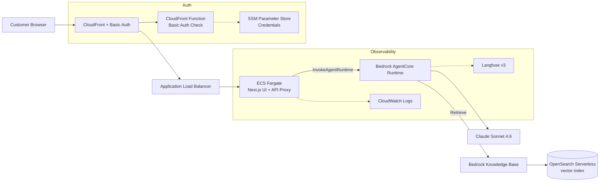
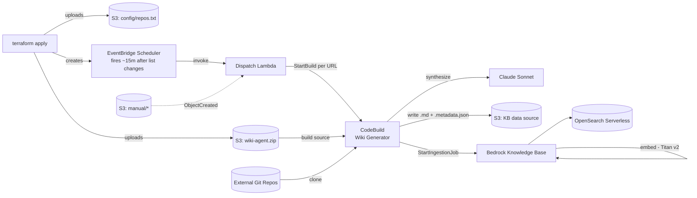

# Architecture — AWS Solutions Advisor (Sales Recommend)

## Overview

A single Strands agent deployed on Bedrock AgentCore, fronted by a Next.js UI on
ECS Fargate, with CloudFront providing CDN, TLS, and basic authentication.

The solution catalog it recommends from is a **Bedrock Knowledge Base backed by
Amazon OpenSearch Serverless — both created and managed by this Terraform
stack** (no longer a pre-provisioned prerequisite). The catalog content is
produced automatically by a **repo → profile data-production pipeline**: a list
of repository URLs drives a fan-out of CodeBuild jobs, each of which uses Claude
to generate a repository capability/vetting profile and ingest it into the
Knowledge Base.

There are two flows that share the Knowledge Base:
- **Query Flow** (synchronous, user-facing)
- **Data Production Flow** (asynchronous, event-driven)

> For a component/edge inventory intended for a diagram generator, see
> [`../architecture_diagram.md`](../architecture_diagram.md).

## Query Flow

## Data Production Flow

The initial trigger is a **cloud-side EventBridge Scheduler** (default 15 min),
not the S3 upload event — so the deploy stays fast and there's no S3
notification-propagation race. The schedule re-arms only when `repos.txt`
content changes. Ad-hoc uploads under the `manual/` prefix still fan out
immediately via S3 notification.

Key design decision: the KB S3 data source uses **chunking = NONE**, so each
repo profile is exactly **one file = one vector**. This keeps retrieval results
whole-repo and prevents cross-repo functionality mixing in recommendations.

## Components

| Component | Technology | Deployment |
|-----------|-----------|------------|
| Agent | Strands SDK + Claude Sonnet 4.6 | Bedrock AgentCore Runtime |
| Knowledge Base | Bedrock KB (Titan Embeddings V2) | **Created by this stack** (`modules/knowledge-base`) |
| Vector store | Amazon OpenSearch Serverless (VECTORSEARCH) | **Created by this stack** |
| KB data source | S3 bucket, chunking = NONE | **Created by this stack** |
| Wiki generator | CodeBuild + Strands agent | **Created by this stack** (`modules/wiki-generator`) |
| Fan-out trigger | S3 event → Dispatch Lambda | **Created by this stack** |
| UI | Next.js 14 + React 18 + Tailwind | ECS Fargate (container) |
| API Proxy | Next.js API route `/api/chat` | Same container as UI |
| CDN + Auth | CloudFront + CloudFront Function | Managed distribution |
| IaC | Terraform | Modules in `infrastructure/` |
| Observability | Langfuse + CloudWatch + X-Ray | Optional (env-var gated) |

## Request Flow (Query)

1. User visits CloudFront URL → CloudFront Function checks `Authorization: Basic ...` header against SSM-stored credentials
2. Authenticated request forwarded to ALB → ECS Fargate (Next.js)
3. Browser renders the React chat UI, user types a message
4. Frontend POSTs to `/api/chat` (same-origin Next.js API route)
5. API route calls `InvokeAgentRuntime` via AWS SDK (credentials from ECS Task Role)
6. AgentCore runs the Strands agent: it calls `retrieve` against the Knowledge Base (`KNOWLEDGE_BASE_ID` env var, injected by Terraform) and generates a response with Claude
7. AgentCore streams the SSE response back through the chain
8. UI renders streaming markdown with interactive choice buttons and highlights sidebar

## Ingestion Flow (Data Production)

1. `terraform apply` provisions the KB, OpenSearch Serverless, CodeBuild, Dispatch Lambda, S3 notification (on the `manual/` prefix), and an EventBridge Scheduler; it uploads `wiki-agent.zip` and `config/repos.txt`
2. The scheduler fires the Dispatch Lambda ~`trigger_delay_minutes` (default 15) after the repo list last changed — a cloud-side delay that doesn't slow the deploy. (Ad-hoc uploads under `manual/` trigger the Lambda immediately via S3 notification.)
3. The Lambda reads the list and calls `StartBuild` once per repo URL
4. Each CodeBuild job clones the repo, packs a filtered view, and prompts Claude (system prompt = `wiki-agent/vetting_prompt.md`) to produce a structured vetting/capability profile
5. The job writes `repos/<host>/<owner>/<repo>.md` + a `.metadata.json` sidecar to the KB data bucket
6. The job calls `StartIngestionJob`; the KB embeds each profile with Titan V2 and writes vectors to OpenSearch Serverless

## Security

- AWS credentials never reach the browser (server-side proxy pattern)
- CloudFront enforces HTTPS; basic-auth credentials stored in SSM (SecureString)
- AgentCore execution role scoped to specific model ARNs and the created KB ARN
- KB service role scoped to the embedding model, its OpenSearch collection, and its S3 data bucket
- CodeBuild and Dispatch Lambda roles least-privileged (read source, write KB bucket, invoke model, start ingestion / start build)
- OpenSearch Serverless secured by encryption, network, and data-access policies
- ECS tasks run in private subnets (NAT for egress)
