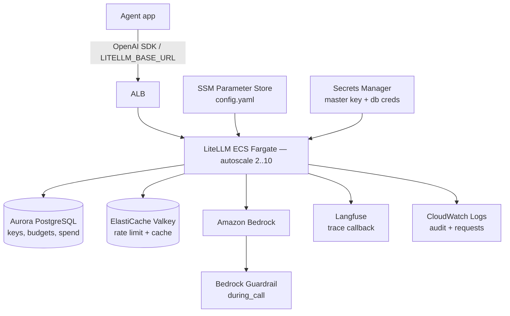

# LLM Gateway — LiteLLM

**OpenAI-compatible gateway for every model call your agents make**


## Overview

LLM Gateway is a single chokepoint every agent passes through on the way to a foundation model. It runs [LiteLLM](https://github.com/BerriAI/litellm) on ECS Fargate, fronts Amazon Bedrock (and any future provider) behind an OpenAI-compatible interface, and consolidates the four enforcement concerns scattered across the platform:

- **Virtual keys** per agent or per team — rotate, revoke, scope
- **Budgets + rate limits** — daily / monthly spend caps and per-key TPM/RPM
- **Bedrock Guardrails attachment** — applied as a `during_call` callback so every prompt is checked, no per-agent SDK change required
- **Audit + observability** — every request lands in CloudWatch and (optionally) Langfuse, with full spend tracking in Postgres

This makes Govern (FinOps, Audit, Compliance) read live data instead of mocks, and it stops a wrongly-configured agent from blowing past a budget or escaping a guardrail.

## Architecture



**Why ECS Fargate (mirrors Foundation Stack):**
- Same operational pattern as Langfuse — VPC/subnet reuse, NAT, Secrets Manager, ECR mirror
- No EKS to operate
- Aurora PostgreSQL Serverless v2 + ElastiCache Valkey 7.2 — same engines the Langfuse stack runs

## Parameters

| Name | Required | Default | Description |
|------|----------|---------|-------------|
| `project_name` | yes | `llm-gateway` | Resource name prefix |
| `aws_region` | no | `us-east-1` | Deployment region |
| `environment` | no | `dev` | dev / staging / prod |
| `master_key` | yes | — | LiteLLM admin master key — sealed in Secrets Manager |
| `enabled_models` | no | Claude Haiku 4.5 + Sonnet 5 + Nova | Bedrock model IDs to expose (Claude 3.5 and older excluded) |
| `attach_guardrail_id` | no | — | Bedrock Guardrail ID to apply on every call |
| `attach_guardrail_version` | no | `DRAFT` | Guardrail version |
| `langfuse_host` | no | — | Foundation Stack output — enables trace emission when set |
| `langfuse_public_key_secret_arn` | no | — | Secrets Manager ARN for Langfuse public key |
| `langfuse_secret_key_secret_arn` | no | — | Secrets Manager ARN for Langfuse secret key |
| `existing_vpc_id` | no | — | Reuse the Foundation Stack VPC (recommended) |
| `cognito_user_pool_id` | no | — | Optional admin-UI SSO |
| `litellm_version` | no | `main-stable` | LiteLLM container tag |

## Deployment

Deploy from the Control Plane:

1. Navigate to **Secure → LLM Gateway**
2. Click **Deploy Gateway**
3. Set `master_key`, choose enabled models, optionally pick a Bedrock Guardrail
4. Click **Deploy**

The deployment provisions:

- ECS Fargate cluster + service (autoscale 2 → 10 on CPU)
- Aurora PostgreSQL Serverless v2 cluster (2 instances)
- ElastiCache Valkey 7.2 replication group
- ALB with HTTP→target group health check on `/health/liveliness`
- ECR repository + first pull/push of `ghcr.io/berriai/litellm-database:<version>`
- Secrets Manager secret (master_key, db password, redis password, salt)
- SSM Parameter `/llm-gateway/<env>/litellm/config.yaml` — the live config
- CloudWatch log group `/aws/ecs/<name>/litellm` (30-day retention)
- IAM task role with `bedrock:InvokeModel`, `bedrock:Converse*`, `bedrock:ApplyGuardrail`

## Outputs

| Output | Use it for |
|--------|------------|
| `gateway_endpoint` | Set as `LITELLM_BASE_URL` on every agent |
| `admin_ui_url` | LiteLLM admin UI (optionally Cognito-protected) |
| `master_key_secret_arn` | Bootstrap the platform's secrets so agents read from Secrets Manager |
| `config_parameter_name` | UI write-back path for live config edits |
| `model_list_endpoint` | OpenAI-compatible `/v1/models` discovery |
| `audit_log_group_name` | Wire into Govern → Audit & Incidents |

## Pointing an agent at the gateway

### LangGraph (ChatLiteLLM)

```python
from langchain_litellm import ChatLiteLLM

llm = ChatLiteLLM(
    model="litellm_proxy/us.anthropic.claude-haiku-4-5-20251001-v1:0",
    api_base="${gateway_endpoint}",
    api_key="<virtual-key-from-LLM-Gateway-UI>",
    temperature=0.1,
    max_tokens=4096,
)

response = llm.invoke([HumanMessage(content="Hello")])
```

### Strands (LiteLLMModel)

```python
from strands.models.litellm import LiteLLMModel
from strands import Agent

model = LiteLLMModel(
    model_id="litellm_proxy/us.anthropic.claude-haiku-4-5-20251001-v1:0",
    client_args={
        "base_url": "${gateway_endpoint}",
        "api_key": "<virtual-key-from-LLM-Gateway-UI>",
    },
    params={"temperature": 0.1, "max_tokens": 4096},
)

agent = Agent(model=model, system_prompt="You are a helpful assistant.")
result = agent("Hello")
```

### OpenAI SDK (low-level)

```python
from openai import OpenAI

client = OpenAI(
    base_url="${gateway_endpoint}/v1",
    api_key="<virtual-key-from-LLM-Gateway-UI>",
)

resp = client.chat.completions.create(
    model="us.anthropic.claude-haiku-4-5-20251001-v1:0",
    messages=[{"role": "user", "content": "Hi"}],
)
```

### AVA Foundations (automatic)

When using the AVA agent foundations (`LangGraphAgent`, `StrandsAgent`, etc.),
gateway routing is handled automatically by setting these environment variables:

```bash
LLM_GATEWAY_BASE_URL=http://gateway:4000
LLM_GATEWAY_API_KEY=sk-...  # or LLM_GATEWAY_API_KEY_SECRET_ARN
```

Setting `LLM_GATEWAY_BASE_URL` enables gateway mode (the `use_llm_gateway`
property derives from this). When unset, agents fall back to direct Bedrock.

The base classes use `ChatLiteLLM` (LangGraph) or `LiteLLMModel` (Strands)
with the `litellm_proxy/` model prefix. Both display aliases (e.g., "Claude Haiku 4.5")
and raw Bedrock model IDs (e.g., "us.anthropic.claude-haiku-4-5-20251001-v1:0")
are recognized by the gateway.

## Links

- [Template manifest](./template.json)
- [LiteLLM project](https://github.com/BerriAI/litellm)
- [Back to Templates Overview](../README.md)
