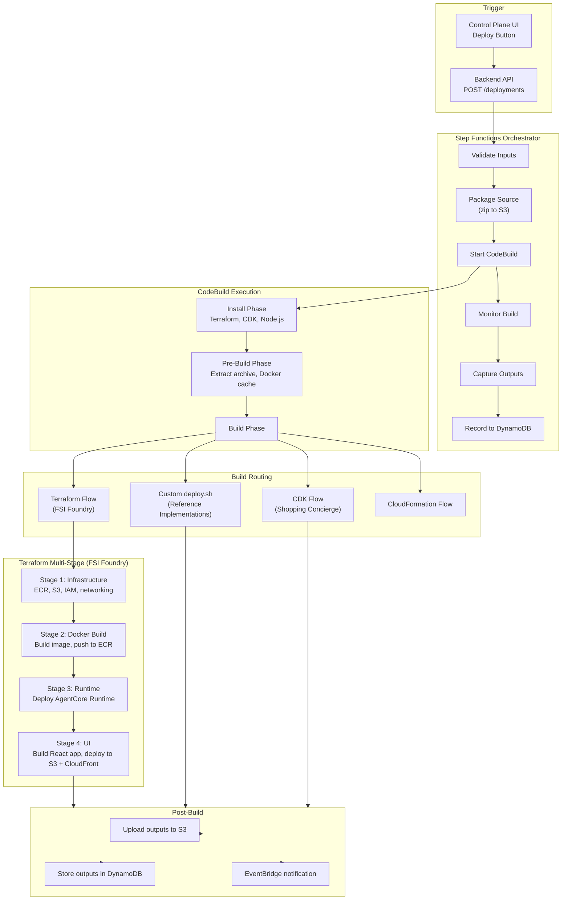
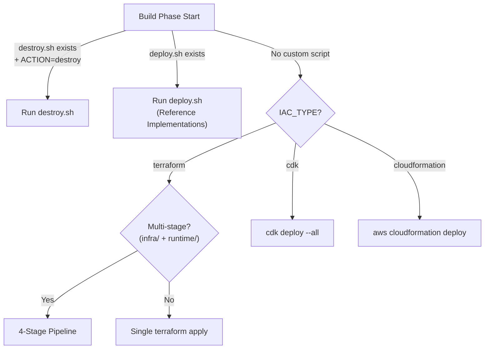
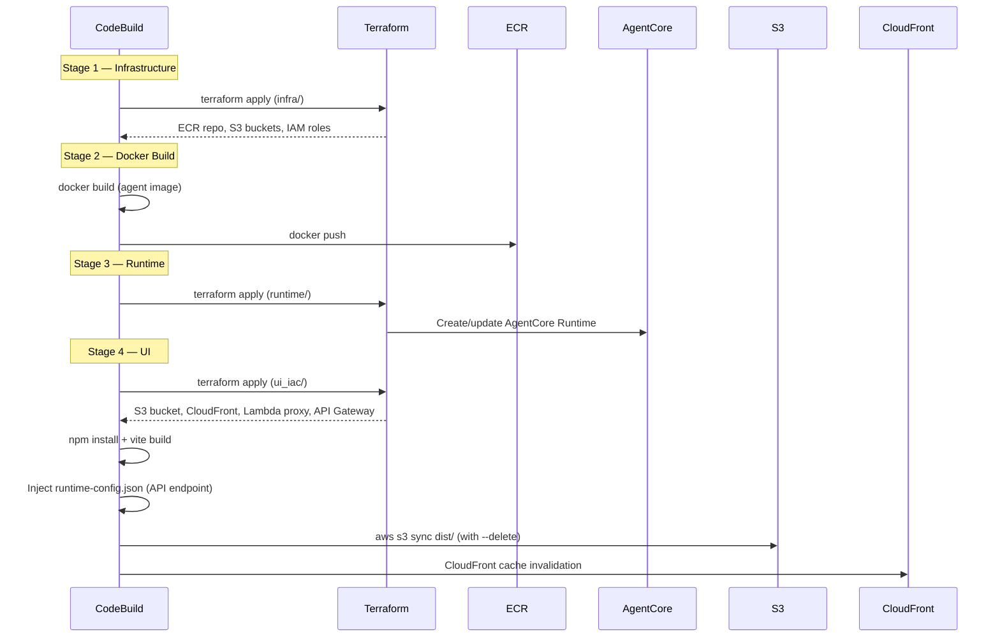

# AVA CI/CD Pipeline Architecture

The AVA platform uses AWS CodeBuild orchestrated by Step Functions to automate the full deployment lifecycle for agent applications.

## Pipeline Overview

## Build Phases

### Install Phase

Installs tools required for deployment:

- **Terraform** >= 1.5.7 (ARM64)
- **AWS CDK** + TypeScript
- **Node.js** 22+ (upgraded at runtime if needed for Vite 8)
- **jq** for JSON processing

### Pre-Build Phase

Prepares the build environment:

1. **Docker cache** — Pre-pulls base images from ECR to avoid Docker Hub rate limits
2. **Archive extraction** — Downloads deployment zip from S3 and extracts to `/tmp/workspace`
3. **Cross-account support** — Assumes target IAM role if `TARGET_ROLE_ARN` is set
4. **Output merger** — Writes a Python script to merge outputs from multiple Terraform stages

### Build Phase — Routing

The build phase routes to the appropriate deployment strategy:

### Terraform Multi-Stage Pipeline (FSI Foundry)

### Post-Build Phase

1. Outputs uploaded to `s3://{state-bucket}/{deployment-id}/outputs.json`
2. Outputs stored in DynamoDB `deployments` table
3. EventBridge event emitted for lifecycle tracking

## Error Handling

| Stage | Guard | Behavior |
|-------|-------|----------|
| Docker build | `\|\| { echo "ERROR"; exit 1; }` | Fails build immediately |
| Terraform apply | `\|\| { echo "ERROR"; exit 1; }` | Fails build immediately |
| UI build (npm) | `\|\| { echo "ERROR"; exit 1; }` | Prevents empty S3 sync |
| UI dist check | `if [ ! -f dist/index.html ]` | Prevents deploying empty build |
| deploy.sh | Exit code check | Captures error in outputs |

## Environment Variables

| Variable | Source | Description |
|----------|--------|-------------|
| `DEPLOYMENT_ID` | Backend API | Unique deployment identifier |
| `TEMPLATE_ID` | Backend API | Template or use case identifier |
| `USE_CASE_ID` | Backend API | FSI Foundry use case name |
| `FRAMEWORK` | Backend API | `langchain_langgraph` or `strands` |
| `IAC_TYPE` | Backend API | `terraform`, `cdk`, or `cloudformation` |
| `AWS_TARGET_REGION` | Backend API | Target AWS region |
| `ARCHIVE_BUCKET` | Backend API | S3 bucket containing deployment zip |
| `ARCHIVE_KEY` | Backend API | S3 key for deployment zip |
| `STATE_BUCKET` | Infrastructure | Terraform remote state bucket |
| `LOCK_TABLE` | Infrastructure | DynamoDB lock table for Terraform |
| `DEPLOYMENTS_TABLE` | Infrastructure | DynamoDB table for deployment metadata |

## Infrastructure

The CodeBuild project is provisioned via Terraform:

- **Compute**: ARM64 (`BUILD_GENERAL1_LARGE`), Linux container
- **Timeout**: 60 minutes
- **Logging**: CloudWatch Logs (14-day retention)
- **Permissions**: IAM role with S3, ECR, DynamoDB, Terraform, CloudFormation, Bedrock, Lambda, CloudFront access
- **Buildspec**: Inline (managed via Terraform `file()` function)
